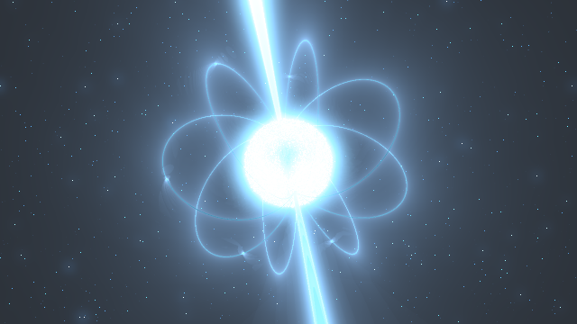
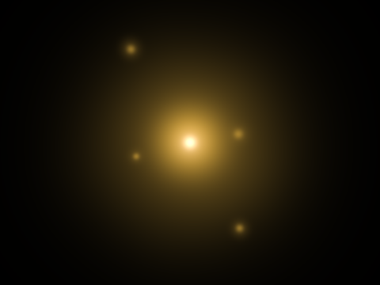
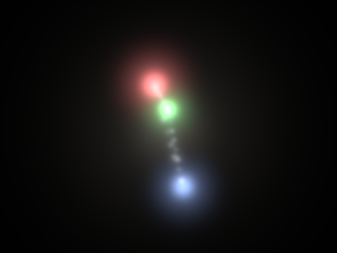
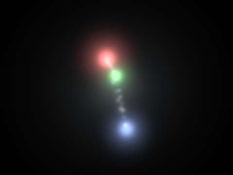
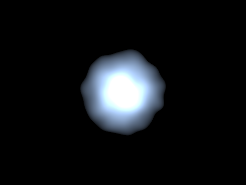
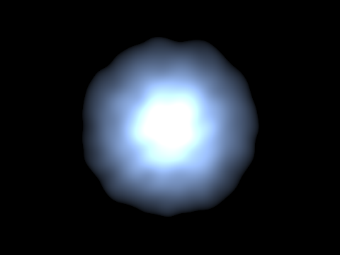
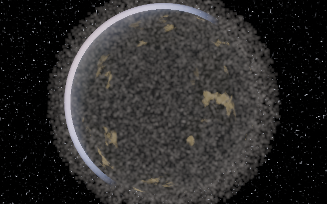
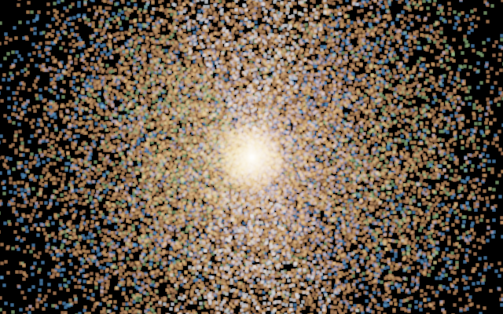

# Warp Shaders

**A hyper-realistic procedural rendering engine for [NVIDIA Warp](https://github.com/NVIDIA/warp)** (`warp-lang`).

Per-pixel `@wp.kernel` shaders — SDF raymarching, procedural noise, PBR,
physically based atmosphere, and volumetrics — written in Python, JIT-compiled
to **CUDA when a GPU is present and to CPU otherwise**, driven by **one quality
knob** (`--quality low|medium|high|ultra`) so the same scene renders on a laptop
CPU and scales to a high-end GPU. Every technique cites a primary source in-code
and in [`docs/research/`](docs/research/).

```python
import warp as wp
import warp_shaders as ws

wp.init()
ws.set_active("high")                                          # quality tier
img = ws.render("earth_v2", width=1280, height=720, time=0.0)  # (H, W, 3) float

# ...or call the engine directly from your own kernel:
ws.procedural   # noise (value/Perlin/simplex/Worley/fbm/ridged/...) + SDF library
ws.engine       # uniforms, PBR, Material, atmosphere (+LUT), volumetrics, post,
                #   analytic soft shadows + AO, colour science, HDR (.hdr/.npy) output
ws.textures     # portable 2D/3D/equirect sampling over wp.array
ws.lod          # quality tiers (low/medium/high/ultra)
ws.life         # L-Systems -> grown plants (grass/herb/tree), ray-cast as real geometry
```

> **📖 Documentation** — the engine has a full manual:
> **[Home](docs/index.md)** ·
> **[Quickstart](docs/quickstart.md)** ·
> **[Concepts](docs/concepts.md)** ·
> **[Writing a scene](docs/guides/writing-a-scene.md)** ·
> **[API reference](docs/api/index.md)** ·
> **[Gallery](docs/gallery.md)**.
> Build the browsable site with `pip install -r docs/requirements.txt && mkdocs serve`.

It's also a **multi-scene gallery**: each shader is one self-contained module in
`warp_shaders/scenes/`, auto-discovered by a registry. Adding a scene is adding
a file — no central list to edit.

## Hyper-realistic engine

A reusable, **tiered, research-grounded rendering engine** — a procedural
toolkit + a render engine with one quality knob so the same scene runs on CPU
here and scales to a high-end GPU. See the [API reference](docs/api/index.md)
for every public symbol.

| noise toolkit | PBR raymarch | atmosphere |
|---|---|---|
|  |  |  |
| **volumetric clouds** | **Earth v2 (flagship)** | **baked-map Earth** |
|  |  |  |
| **terrain** | **ocean** | **volumetric nebula** |
|  |  |  |
| **gas giant + rings** | **alien world (twin suns)** | **spiral galaxy** |
|  |  |  |
| **aurora** | **lava planet** | **desert dunes** |
|  |  |  |
| **glacier** | **depth of field** | **slot canyon** |
|  |  |  |
| **underwater reef** | | |
|  | | |

- **Procedural toolkit** (`warp_shaders/procedural/`) — value/Perlin/Worley/fbm/
  ridged/billow/domain-warp/curl noise **with analytic derivatives**, plus an SDF
  primitive+operator library. Sources: IQ, Gustavson, McGuire, Bridson.
- **Render engine** (`warp_shaders/engine/`) — `@wp.struct` uniforms (camera/light/
  frame/quality), an adaptive sphere-tracing raymarcher, **GGX Cook-Torrance PBR**,
  **physically based atmospheric scattering** (Nishita/O'Neil Rayleigh+Mie **plus
  Hillaire multiple scattering**), a **volumetric cloud** raymarcher (Schneider
  density, Henyey-Greenstein, Beer-Lambert, sun light-march) over a **baked seamless
  3D detail volume**, a **thin-lens depth-of-field** camera, **analytic soft
  shadows + ambient occlusion** (closed-form sphere shadow/AO, no SDF march), and
  a host **post** pipeline (ACES/AgX tonemap, bloom, **god-rays**, chromatic
  aberration, sharpen, grain, vignette) with one-call **named looks** (cinematic /
  film / dreamy / crisp). Frames save to PNG or true **HDR** (`.hdr` RGBE / `.npy`).
- **Cinematics** — **keyframed camera paths** (Catmull-Rom eye + eased target/FOV;
  `engine.camera_path`), **video export** (H.264 **MP4** / WebP / GIF via
  `engine.video`, `render.py --video`), and a **showcase reel** (`reel.py`) that
  stitches scenes with crossfades + Ken-Burns. See the
  [cinematics guide](docs/guides/cinematics.md).
- **LOD tiers** (`warp_shaders/lod.py`) — one knob scales raymarch/shadow/AO/atmosphere/
  cloud sample counts, octaves, LUT sizes; auto-detected per device.
- **Textures & LUTs** (`warp_shaders/textures.py`) — portable bilinear sampling over
  `wp.array2d` (CPU+CUDA): equirectangular planet maps (bake once, or drop in a NASA
  **Blue Marble** JPG via `load_equirect`), precomputed **atmosphere transmittance +
  multiple-scattering LUTs**, and baked **3D noise volumes** (`sample3d`) for cheap
  cloud detail and emissive nebulae.

```bash
python render.py --scene earth_v2 --quality high -o earth.png   # the flagship
python render.py --scene sky --quality medium --frames 120 --gif out/day.gif
python render.py --scene pbr_demo --quality ultra -o pbr.png
python -m tests.test_procedural                                  # toolkit tests
```

The earlier scenes and the nuclear/Earth **simulations** now render through the
engine's post pipeline too. Grounded in Warp v1.12+ hardware textures
(`wp.Texture2D/3D`, mipmaps) — precomputed atmosphere LUTs and a Blue Marble map
are the next tier of realism.

The flagship scene is a **neutron star**: a dense pulsar core with relativistic
jets along the magnetic axis, magnetic field rings, orbiting matter, and a
cube-mapped starfield — a Warp port of the GLSL Shadertoy original kept at
[`reference/neutron-star.frag`](reference/neutron-star.frag).

| neutron star | sun | black hole |
|---|---|---|
|  |  |  |
| **planet** | **earth** (realistic) | |
|  |  | |

The **earth** scene is a realistic globe: ray-sphere planet with atmospheric
scattering (blue rim + sunset limb), oceans with a specular sun-glint, procedural
continents, drifting clouds, a day/night terminator with night-side city lights,
over a starfield — fully procedural, no texture asset. Shading lives in
[`warp_shaders/earthgfx.py`](warp_shaders/earthgfx.py), shared with the Earth
blast simulation below.

## Life — from molecule to plant

The engine shows life across scales. At the **bottom of the ladder**
(`warp_shaders.life.molecular` / `.cell`), the sub-plant scales the arc names —
**DNA → protein → cell** — each animated: a **DNA double helix** assembles
base-pair by base-pair (B-DNA geometry, colour-coded A/T/G/C), a **protein**
backbone folds from an extended chain into a compact α-helix/β-strand, and a
**cell** divides — membrane pinching, nucleus and organelles partitioning into
two (mitosis). DNA and protein are solid ray-traced meshes; the cell is a soft
glow volume, bridging the atom strand's look into tangible life.

| DNA | protein | cell (dividing) |
|---|---|---|
|  |  |  |


See [docs/research/05-molecular-to-cell.md](docs/research/05-molecular-to-cell.md).

## Life — L-Systems that grow

`warp_shaders.life` grows plants from **L-System grammars** (Prusinkiewicz &
Lindenmayer, *The Algorithmic Beauty of Plants*) — all four classes (D0L,
stochastic, context-sensitive, parametric) — interprets them with a 3D turtle,
tessellates to a triangle mesh, and **ray-casts real geometry** through the Warp
engine (`wp.Mesh` BVH + `wp.mesh_query_ray`, GGX PBR, cast shadow, sky, post).
Generation advances with `time`, so they grow.

| grass | herb | tree | fern | flower | bush |
|---|---|---|---|---|---|
|  |  |  |  |  |  |

A whole **meadow** — several plants merged into one mesh, swaying in one wind:


```bash
python render.py --scene tree --frames 8 --fps 1 --gif out/tree.gif  # watch it grow
python render.py --scene grass --time 9 -o grass.png
python -m tests.test_lsystem                                         # grammar tests
```


**Environmental response — the "obvious rules" (ABOP §2.3.4).** Before any mind,
the plant obeys physics: a **tropism** bends the turtle's heading toward a
direction each step. So a sapling bends to **follow a light** (phototropism), a
weeper's shoots **sag under gravity** (gravitropism), leaves **fold shut in the
rain** (nyctinasty), and a tuft **sways in a gust** (a time-varying tropism) —
all emergent from the same grammar plus an environment signal, no decisions yet.

| phototropism | weeping | rain-fold | wind |
|---|---|---|---|
|  |  |  |  |

| following the light | closing in the rain | swaying in a gust |
|---|---|---|
|  |  |  |

```bash
python render.py --scene phototropism --frames 24 --fps 12 --gif out/photo.gif
python render.py --scene rain_fold --time 5 -o rain.png
```

**The mind — choosing to obey.** Top of the ladder: a **Conway Game of Life**
mind whose living population sets a **drive** that *chooses* whether the plant
seeks the light (open, phototropic) or rests (sags, leaves folded). Unlike the
reflex `phototropism` scene, here the plant follows the light **only when the
mind decides to** — a decision, not a reflex. The inset shows the deliberating
grid + a drive bar.


And a **per-branch** mind (`mind_branches`): one plant with several shoots, each
steered by a different band of the same grid — so some shoots reach up and open
toward the light while others sag and fold shut, all at once. This is the
operator's *"close piece of itself"* — the decision is per-part, not global.


The mind steers the plant through the same per-frame seam the obvious rules use
(`grow_mesh_env`), so it commands the very reflexes the plant already has. See
[docs/research/06-the-mind.md](docs/research/06-the-mind.md) and
[04-lsystems.md](docs/research/04-lsystems.md).

## Life — wave and collapse

The summit of the strand. Several *possible* plant futures begin **superposed** —
a faint overlapping ghost cloud of what the plant might become — and **collapse**
to a single realised plant, the front sweeping tip→base so the form crystallises
future-first, reaching *backward* into its own history. The Conway mind biases
*which* future resolves. An explicit metaphor for the operator's *"how things are
waves before what to us seems like a collapse in the world."*


Rendered once and cached (fixed camera), then only the cheap per-frame blend
re-runs. See [docs/research/07-wave-and-collapse.md](docs/research/07-wave-and-collapse.md).

## Life — an ecosystem over the seasons

Life at the **population scale**: a patch of plants that live over **years** —
born, growing, blooming, senescing, dying, with new seedlings filling the gaps.
The meadow **recolours with the seasons** (green summer → gold autumn → sparse
winter → fresh spring) and the plants **compete for light** — a plant shaded by
taller neighbours grows less and **leans toward the open sky** (the tropism layer,
now driven by its neighbours). Deterministic from a seed, grown through the usual
L-System pipeline and merged into one ray-cast mesh.

| summer | autumn | winter |
|---|---|---|
|  |  |  |


See [docs/research/08-ecosystem.md](docs/research/08-ecosystem.md).

## The atom, from the bottom up

A second, composable strand: build an atom out of its constituents. These scenes
are **physics-informed but stylized**, and each higher level reuses the lower
primitives from [`warp_shaders/particles.py`](warp_shaders/particles.py).

| quark | proton | neutron |
|---|---|---|
|  |  |  |
| color charge r→g→b, gluon wisps | up+up+down, color-neutral | up+down+down, color-neutral |

| electron | atom (hydrogen) |
|---|---|
|  |  |
| 1s probability cloud | proton nucleus inside the 1s cloud |

What's modeled (stylized, not to scale):

- **Quark** — a lone quark can't be isolated (confinement), so it's shown as one
  orb whose QCD **color charge** cycles red→green→blue, with gluon wisps.
- **Proton / neutron** — three quarks (`uud` / `udd`) whose red/green/blue color
  charges sum to **color-neutral**, bound by **gluon flux tubes**. Same shared
  `nucleon` primitive; down quarks render dimmer, and the confinement "bag" is
  warm for the proton (+1) vs cool for the neutron (0).
- **Electron** — a point lepton rendered as the hydrogen **1s orbital**
  probability cloud (`exp(-r/a)`), volumetrically integrated with quantum sparkle.
- **Atom** — a proton nucleus wrapped by the electron's 1s cloud. The nucleus is
  exaggerated (a real one is ~1e-5 of the atom) so its structure stays visible.

The build is genuinely bottom-up: `atom` composes the same `nucleon` used by
`proton`, and the same cloud integrator used by `electron`. Heavier atoms (more
nucleons, more electron shells) extend the same primitives.

## Elements — the stylized (non-realistic) aesthetic

A deliberately artistic take on the atom: the iconic neon **Bohr-model** look —
a glowing packed nucleus (warm protons + cool neutrons) wrapped by tilted
electron shells with orbiting electrons. One generic Warp kernel renders **any**
element from runtime parameters (Z protons, N neutrons, electrons-per-shell), so
all elements share one code path.

| H | He | C | O |
|---|---|---|---|
|  |  |  |  |
| **Ne** | **Na** | **Cl** | **Ar** |
|  |  |  |  |

**18 elements** (periods 1–3, H → Ar) are registered as scenes, each with the
correct proton/neutron count and shell occupancy (e.g. Ar = 2-8-8):

```bash
python render.py --scene carbon -o carbon.png
python render.py --scene argon  --frames 120 --fps 30 --gif out/argon.gif
python render.py --list          # every element shows up
```

Adding more elements is one row in the data table in
[`warp_shaders/scenes/elements.py`](warp_shaders/scenes/elements.py) — the
kernel already handles any Z / N / shell configuration.

## Simulations — gravity, chain reactions, blasts

Everything above is a *per-pixel shader*. This part uses Warp for what it's
actually built for: **GPU particle simulation**. A stateful particle system
evolves over time under real forces (a Warp kernel integrates gravity, thermal
buoyancy, drag, and cooling each step), driving nuclear and thermonuclear blasts
— **with the full chain reaction**, and an optional **gravity drop** beforehand.

| nuclear (fission) | thermonuclear (fission → fusion) |
|---|---|
|  |  |

```bash
python simulate.py --scenario nuclear       --drop --gif out/nuke.gif
python simulate.py --scenario thermonuclear --drop --gif out/thermo.gif
python simulate.py --scenario thermonuclear --no-images   # just the chain-reaction report
```

Each run has three phases:

1. **Drop** — the device falls under gravity (real ballistic motion) to the burst altitude.
2. **Chain reaction** — a fission cascade modelled with self-limiting **point kinetics**: one seed neutron multiplies (`k_eff > 1`) until the fuel burns up and reactivity drops below critical — the characteristic neutron-population *pulse*. `simulate.py` prints the generation-by-generation table:

   ```
   frame |  fission n |  fis.E | fusion n |  fus.E
      29 |      67.49 |  0.000 |     0.00 |  0.000
      39 |   68326.77 |  0.076 |     0.00 |  0.000
      44 |  327225.23 |  0.791 |     0.00 |  0.000   <- fission peaks, fuel burning out
   ```

3. **Fireball** — the released energy spawns a hot particle fireball that expands, then rises by buoyancy against gravity + drag → mushroom cloud (the camera tracks it up).

**Thermonuclear** adds a second stage: once the fission *primary* releases enough energy it **ignites** a fusion *secondary* (the Teller–Ulam idea) — a second, much larger pulse and fireball (~25× the yield here). Physics timescale is dramatised onto frames; energies are arbitrary units for comparison, not megatons.

Runs on CPU here (Warp's CPU codegen); identical on CUDA, in real time. See
[`warp_shaders/sim/`](warp_shaders/sim/) — `engine.py` (particles + integrate
kernel + splat renderer) and `blast.py` (drop + kinetics + fireball).

## Earth — every warhead at once (a sensitization piece)

A gravitationally-bound **particle Earth** under simultaneous global detonation.
Grounded in real numbers, because the truth is sharper than the sci-fi: the
entire arsenal is **~10⁻¹³ of Earth's gravitational binding energy** — the
dinosaur-killer impact was **~26,000× larger** and Earth survived geologically.
So the planet does **not** shatter. What dies is everything living on it.

Three outcomes, chosen one at a time; three arsenals (`current` ~9,500 · `total`
~12,500 re-armed · `peak` ~60,000):

| grounded (real) | toxic (real) | shatter (hypothetical) |
|---|---|---|
|  |  |  |
| planet intact, global flashes | nuclear-winter soot shroud, dead world | alien "softron" energy → rock + ice cloud |

```bash
python simulate_earth.py --arsenal total --outcome grounded  --gif out/earth.gif
python simulate_earth.py --arsenal total --outcome toxic     --gif out/toxic.gif
python simulate_earth.py --arsenal peak  --outcome shatter    --gif out/shatter.gif
python simulate_earth.py --arsenal total --no-images          # the honest report:
```

```
warheads               : 12,500
total yield            : 3,800 Mt  =  1.590e+19 J
arsenal / binding      : 7.09e-14   (need >= 1 to disperse the planet)
blast dv / escape vel  : 2.66e-07   (escape = 11,186 m/s)
dino-killer / arsenal  : 26,416x  (and Earth survived that)
VERDICT: PLANET INTACT. ...
```

- **grounded / toxic** are real physics: the planet is in equilibrium and stays
  put; the arsenal only scorches the surface. They render the **realistic globe**
  (the same `earthgfx` shader as the `earth` scene) with detonation flashes
  clustered over real basing regions; `toxic` greys the surface and layers on the
  firestorm soot shroud (nuclear winter) — the honest catastrophe.
- **shatter** is explicitly labeled non-physical: energy scaled to Earth's
  binding energy (~10¹³× the real arsenal) so the planet disperses; inner debris
  falls back into clumps under self-gravity (`_grav` kernel) — a shambling rock +
  ice cloud. This is the alien-weapon *hypothetical*, not what nukes do.

The point: you never needed to break the planet to end the world on it.

## Super-Earth — one planet, every knob

A "cheated" planet: one Warp kernel driven by a `PlanetConfig` struct where
**every feature is an independent knob** — ocean, lakes, rivers, mountains, snow,
volcanoes, lava, vegetation, a living bioluminescence, city lights, atmosphere,
clouds, moons. Turn any of them on or off; the same code renders a barren rock, a
living earth, an ocean world, or a molten hell. It's a stress-test of the engine
— *play with it and find the limits.* See
[Research 09](docs/research/09-super-earth.md).

| earth-like | volcanic | living (night) | flat (no mountains) |
|---|---|---|---|
|  |  |  |  |

Then the **super-planets** — higher degrees of freedom, no solid surface: a
banded **gas giant** with a great red spot, a **windstorm** world of turbulent
bands and cyclone eyes, and a dark **electrostorm** crackling with lightning.

| gas giant | windstorm | electrostorm |
|---|---|---|
|  |  |  |

And a configurable orbital **bombardment** — warhead count, distribution formula
(uniform / clustered / equatorial / spiral), delay, interval, and detonations in
parallel per wave — fireballs cooling through a blackbody ramp, each leaving an
expanding shock-ring scar:


```bash
python render.py --scene super_earth  -o out/earthlike.png       # earth-like preset
python render.py --scene se_gas       -o out/gas.png             # a gas giant
python render.py --scene se_flat      -o out/flat.png            # mountains off
python render.py --scene se_electrostorm --frames 40 --gif out/electro.gif
python render.py --scene se_nuked     --frames 56 --fps 16 --gif out/nuked.gif
```

```python
from warp_shaders.superearth import make_config, render_planet
cfg = make_config(has_ocean=1, has_rivers=1, mountain=0.8, veg=0.9, cloud=0.6)
img = render_planet(cfg, 960, 540, quality="high")   # your own world, by config
```

## The solar system — the namesake

The project's namesake: a **configurable solar system** (`warp_shaders.cosmos`).
One renderer draws any mix of **1–7 stars** — **sun**, **neutron star**, **white
dwarf**, **black hole** — and **configurable planets** (each a super-earth
`PlanetConfig`) on chosen **Keplerian orbits**, plus an optional **nebula**. Each
body is built from real physics: convection granulation + limb darkening on the
sun, twin precessing pulsar beams on the neutron star, and a black hole rendered
by integrating the **GR photon-orbit equation** — Einstein ring, photon ring,
Doppler-beamed accretion disk (the *Interstellar* look), and it lenses the whole
system around it. See [Research 10](docs/research/10-solar-system.md).

| sun | neutron star | white dwarf | black hole |
|---|---|---|---|
|  |  |  |  |

The first system is a live, precessing **neutron star with one planet** on an
inclined ellipse; others are a **binary**, a **trinary** of mixed star types, a
**black-hole system**, and a system cradled in a **nebula**:

| the first system | trinary (mixed stars) | black-hole system |
|---|---|---|
|  |  |  |

And a **destructive** scenario — the default is stable, but a switch runs real
**N-body** gravity: two suns spiral in, **merge**, and (past the mass thresholds)
**collapse** into a black hole with a supernova flash, which then **swallows** the
planet:


```bash
python render.py --scene solar_system --frames 60 --fps 12 --gif out/ss.gif
python render.py --scene ss_blackhole -o out/bh_system.png   # a hole lensing its system
python render.py --scene ss_collapse  --frames 60 --fps 16 --gif out/collapse.gif
```

```python
from warp_shaders.cosmos import presets, render_system
img = render_system(presets.get("trinary"), 960, 540, time=0.0)   # or build your own
```

## Install

```bash
python -m venv .venv && source .venv/bin/activate
pip install -r requirements.txt
```

`warp-lang` ships its own CPU/CUDA codegen — no separate CUDA toolkit needed for
CPU rendering. On a machine with an NVIDIA GPU + driver, Warp uses it
automatically.

## Render

```bash
python render.py --list                         # show available scenes

# single frame (auto device: CUDA if available, else CPU)
python render.py --scene neutron_star --time 2.0 --width 1280 --height 720 -o frame.png

# a spinning GIF
python render.py --scene neutron_star --frames 60 --fps 30 --gif out/spin.gif

# PNG frame sequence
python render.py --scene neutron_star --frames 120 --out-dir out/frames

# force CPU (works anywhere; slower)
python render.py --scene neutron_star --device cpu --width 640 --height 360 -o frame.png
```

`--mouse MX MY` drives the camera/pan, matching the shader's `iMouse` convention
(pixel coordinates).

## Add a scene (the workflow for every new shader)

1. Copy the template:

   ```bash
   cp warp_shaders/scenes/_template.py warp_shaders/scenes/my_scene.py
   ```

2. Write the kernel and set the `SCENE` name. Every scene implements the **same
   kernel contract**, which is what keeps the launcher uniform:

   ```python
   @wp.kernel
   def render_kernel(img: wp.array2d(dtype=wp.vec3),
                     width: int, height: int, time: float, mouse: wp.vec2):
       i, j = wp.tid()          # i = row, j = column
       ...
       img[i, j] = wp.vec3(r, g, b)

   SCENE = Scene(name="my_scene", kernel=render_kernel, description="...")
   ```

3. It's live immediately:

   ```bash
   python render.py --list
   python render.py --scene my_scene -o my_scene.png
   ```

Underscore-prefixed modules (like `_template.py`) are skipped by discovery.

### GLSL → Warp cheatsheet

Porting a Shadertoy shader is mostly mechanical. The main friction is that Warp
has no swizzles and distinguishes scalars from vectors:

| GLSL | Warp |
|---|---|
| `mainImage(out vec4 c, in vec2 fragCoord)` | the `render_kernel` body |
| `iResolution` / `iTime` / `iMouse` | `width, height` / `time` / `mouse` kernel args |
| `mix(a, b, t)` | `wp.lerp(a, b, t)` |
| `fract(x)` | `x - wp.floor(x)` (or `sdf.fract`) |
| `atan(y, x)` | `wp.atan2(y, x)` |
| `p.xz = rotate(p.xz, a)` | rebuild: `r = rot2(wp.vec2(p[0], p[2]), a); p = wp.vec3(r[0], p[1], r[1])` |
| `v.x` / `v.y` / `v.z` | `v[0]` / `v[1]` / `v[2]` |
| `void f(out float m)` | return a tuple: `return dist, m` |
| `texture(iChannel0, uv)` (image) | a procedural `@wp.func` (fBm/noise) — see `black_hole.py`'s `nebula_tex` or `sun.py`'s `sun_tex` |
| `texture(iChannel1, ...)` (audio FFT) | dropped — use a fixed constant (no audio) |

**Channel convention.** Shadertoy shaders often read image/audio from
`iChannelN`. This gallery has no bound channels, so ports substitute them:
image textures become procedural noise `@wp.func`s, and audio reactivity is
dropped in favor of a fixed constant (scenes still animate via `time`). That
keeps every scene self-contained and asset-free. (If a scene ever needs a real
image, we can add a texture-array sampling path then — the kernel contract
stays the same.)

Reusable building blocks live in `warp_shaders/sdf.py` (`hash2d`, `noise2d`,
`fbm2d`, `rot2`, `sd_torus`, `fract`). Grow that toolkit as scenes share more
primitives. See `warp_shaders/scenes/neutron_star.py` next to
`reference/neutron-star.frag` for a full worked port.

## Layout

```
render.py                        CLI: per-pixel scenes (--list, --scene, frame / GIF)
simulate.py                      CLI: particle-sim blasts (nuclear / thermonuclear, --drop)
simulate_earth.py                CLI: Earth under global detonation (grounded/toxic/shatter)
warp_shaders/
  scene.py                       Scene contract + auto-discovery registry
  sdf.py                         reusable @wp.func toolkit (hash/noise/fbm/rot/SDF)
  particles.py                   particle primitives (quark/gluon/nucleon + camera + volumetrics)
  earthgfx.py                    realistic-Earth shading (scene + sim share it)
  sim/                           stateful particle simulation (Warp physics)
    engine.py                    ParticleSystem: integrate kernel + splat renderer
    blast.py                     gravity drop + chain-reaction kinetics + fireball
    earth.py                     gravitationally-bound Earth + arsenals + outcomes + report
  scenes/
    neutron_star.py              flagship pulsar scene
    black_hole.py                gravitationally-lensed BH + accretion disk
    planet.py                    lit planet + distant star + lens flare (iq/mu6k)
    sun.py                       trisomie21 star corona (texture -> procedural)
    starfield.py                 minimal scene (registry demo)
    quark.py  proton.py          the atom, bottom-up: quark -> nucleons ...
    neutron.py electron.py atom.py   ... -> electron -> hydrogen atom
    elements.py                  18 stylized Bohr-model elements (one generic kernel)
    earth.py                     realistic Earth from space (uses earthgfx)
    _template.py                 copy-me starter (skipped by discovery)
reference/
  neutron-star.frag              original GLSL shaders (provenance / cross-check)
  black-hole.frag
  planet.frag
  sun.frag
docs/*.png                       rendered stills (one per scene)
requirements.txt
```

## Why Warp instead of a GLSL player

Warp kernels are ordinary Python that JIT-compile to native CUDA/CPU, so the
same raymarcher is scriptable, differentiable-capable, and composes with NumPy
and the rest of a simulation pipeline — while still reading like a shader.
