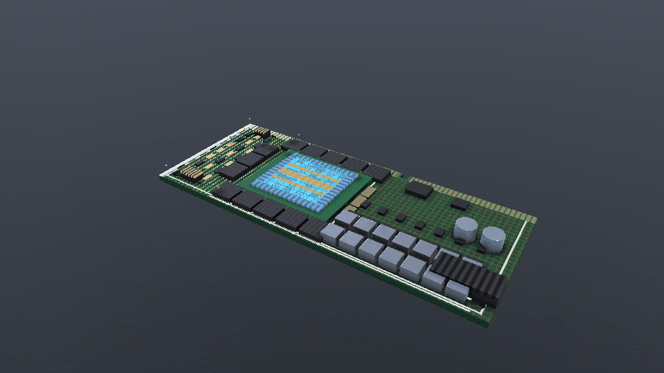
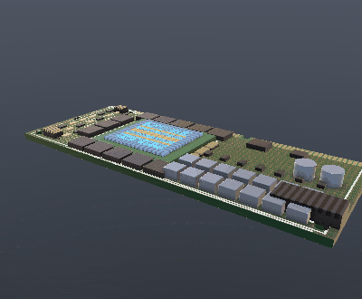
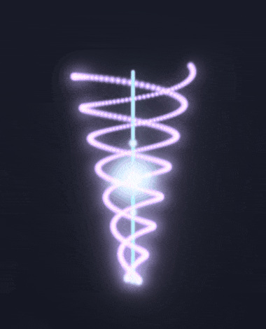
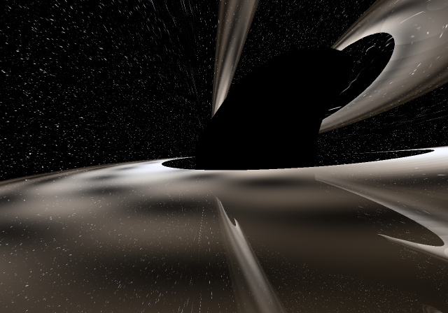
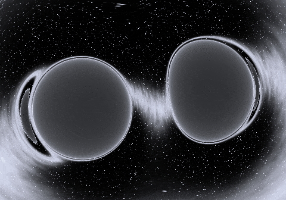
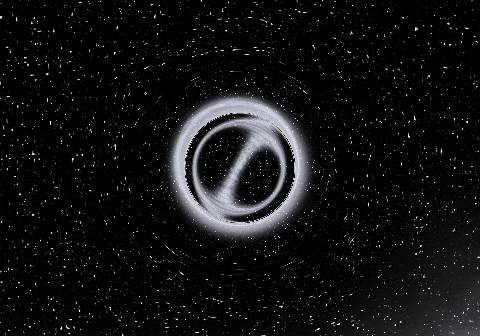

# Warp Shaders

**A hyper-realistic procedural rendering engine for [NVIDIA Warp](https://github.com/NVIDIA/warp)** (`warp-lang`).

Per-pixel `@wp.kernel` shaders — SDF raymarching, procedural noise, PBR,
physically based atmosphere, and volumetrics — written in Python, JIT-compiled
to **CUDA when a GPU is present and to CPU otherwise**, driven by **one quality
knob** (`--quality low|medium|high|ultra`) so the same scene renders on a laptop
CPU and scales to a high-end GPU. Every technique cites a primary source in-code
and in [`docs/research/`](docs/research/).

```python
import warp as wp
import warp_shaders as ws

wp.init()
ws.set_active("high")                                          # quality tier
img = ws.render("earth_v2", width=1280, height=720, time=0.0)  # (H, W, 3) float

# ...or call the engine directly from your own kernel:
ws.procedural   # noise (value/Perlin/simplex/Worley/fbm/ridged/...) + SDF library
ws.engine       # uniforms, PBR, Material, atmosphere (+LUT), volumetrics, post,
                #   analytic soft shadows + AO, colour science, HDR (.hdr/.npy) output
ws.textures     # portable 2D/3D/equirect sampling over wp.array
ws.lod          # quality tiers (low/medium/high/ultra)
ws.life         # L-Systems -> grown plants (grass/herb/tree), ray-cast as real geometry
ws.blast        # nuclear-detonation physics — Tsar Bomba scaling laws (fireball/blast/mushroom)
```

> **📖 Documentation** — the engine has a full manual:
> **[Home](docs/index.md)** ·
> **[Quickstart](docs/quickstart.md)** ·
> **[Concepts](docs/concepts.md)** ·
> **[Writing a scene](docs/guides/writing-a-scene.md)** ·
> **[API reference](docs/api/index.md)** ·
> **[Gallery](docs/gallery.md)**.
> Build the browsable site with `pip install -r docs/requirements.txt && mkdocs serve`.

It's also a **multi-scene gallery**: each shader is one self-contained module in
`warp_shaders/scenes/`, auto-discovered by a registry. Adding a scene is adding
a file — no central list to edit.

## Hyper-realistic engine

A reusable, **tiered, research-grounded rendering engine** — a procedural
toolkit + a render engine with one quality knob so the same scene runs on CPU
here and scales to a high-end GPU. See the [API reference](docs/api/index.md)
for every public symbol.

| noise toolkit | PBR raymarch | atmosphere |
|---|---|---|
|  |  |  |
| **volumetric clouds** | **Earth v2 (flagship)** | **baked-map Earth** |
|  |  |  |
| **terrain** | **ocean** | **volumetric nebula** |
|  |  |  |
| **gas giant + rings** | **alien world (twin suns)** | **spiral galaxy** |
|  |  |  |
| **aurora** | **lava planet** | **desert dunes** |
|  |  |  |
| **glacier** | **depth of field** | **slot canyon** |
|  |  |  |
| **ringed vista** (giant over dunes) | **binary sea** (twin suns) | **comet** (ion + dust tails) |
|  |  |  |
| **volcano** (night eruption) | **crystal cave** (glowing shards) | **hurricane** (from orbit) |
|  |  |  |
| **underwater reef** | **Mandelbulb fractal** | **Mandelbox fractal** |
|  |  |  |
| **Menger sponge** | **Sierpinski tetrahedron** | **kaleidoscopic temple (KIFS)** |
|  |  |  |
| **Tsar Bomba (50 Mt)** | **Super Tsar (500 Mt)** | **Super Tsar in space** |
|  |  |  |

- **Procedural toolkit** (`warp_shaders/procedural/`) — value/Perlin/Worley/fbm/
  ridged/billow/domain-warp/curl noise **with analytic derivatives**, plus an SDF
  primitive+operator library and **3D fractal distance estimators**
  (**Mandelbulb** triplex power, **Mandelbox** folds, **Menger sponge** exact SDF,
  **Sierpinski** tetrahedron, and a **kaleidoscopic IFS** temple — all with
  orbit-trap colour; `procedural.fractal`). Sources: IQ, Gustavson, McGuire,
  Bridson, White-Nylander, Lowe, Knighty.
- **Render engine** (`warp_shaders/engine/`) — `@wp.struct` uniforms (camera/light/
  frame/quality), an adaptive sphere-tracing raymarcher, **GGX Cook-Torrance PBR**,
  **physically based atmospheric scattering** (Nishita/O'Neil Rayleigh+Mie **plus
  Hillaire multiple scattering**), a **volumetric cloud** raymarcher (Schneider
  density, Henyey-Greenstein, Beer-Lambert, sun light-march) over a **baked seamless
  3D detail volume**, a **thin-lens depth-of-field** camera, **analytic soft
  shadows + ambient occlusion** (closed-form sphere shadow/AO, no SDF march),
  **reflection + refraction** (mirror/glass bounce loop — Fresnel, Snell, TIR;
  `engine.raytrace`), and
  a host **post** pipeline (ACES/AgX tonemap, bloom, **god-rays**, chromatic
  aberration, sharpen, grain, vignette) with one-call **named looks** (cinematic /
  film / dreamy / crisp). Frames save to PNG or true **HDR** (`.hdr` RGBE / `.npy`).
- **Cinematics** — **keyframed camera paths** (Catmull-Rom eye + eased target/FOV;
  `engine.camera_path`), **video export** (H.264 **MP4** / WebP / GIF via
  `engine.video`, `render.py --video`), and a **showcase reel** (`reel.py`) that
  stitches scenes with crossfades + Ken-Burns. See the
  [cinematics guide](docs/guides/cinematics.md).
- **LOD tiers** (`warp_shaders/lod.py`) — one knob scales raymarch/shadow/AO/atmosphere/
  cloud sample counts, octaves, LUT sizes; auto-detected per device.
- **Textures & LUTs** (`warp_shaders/textures.py`) — portable bilinear sampling over
  `wp.array2d` (CPU+CUDA): equirectangular planet maps (bake once, or drop in a NASA
  **Blue Marble** JPG via `load_equirect`), precomputed **atmosphere transmittance +
  multiple-scattering LUTs**, and baked **3D noise volumes** (`sample3d`) for cheap
  cloud detail and emissive nebulae.

```bash
python render.py --scene earth_v2 --quality high -o earth.png   # the flagship
python render.py --scene sky --quality medium --frames 120 --gif out/day.gif
python render.py --scene pbr_demo --quality ultra -o pbr.png
python -m tests.test_procedural                                  # toolkit tests
```

The earlier scenes and the nuclear/Earth **simulations** now render through the
engine's post pipeline too. Grounded in Warp v1.12+ hardware textures
(`wp.Texture2D/3D`, mipmaps) — precomputed atmosphere LUTs and a Blue Marble map
are the next tier of realism.

The flagship scene is a **neutron star**: a dense pulsar core with relativistic
jets along the magnetic axis, magnetic field rings, orbiting matter, and a
cube-mapped starfield — a Warp port of the GLSL Shadertoy original kept at
[`reference/neutron-star.frag`](reference/neutron-star.frag).

| neutron star | sun | black hole |
|---|---|---|
|  |  |  |
| **planet** | **earth** (realistic) | |
|  |  | |

The **earth** scene is a realistic globe: ray-sphere planet with atmospheric
scattering (blue rim + sunset limb), oceans with a specular sun-glint, procedural
continents, drifting clouds, a day/night terminator with night-side city lights,
over a starfield — fully procedural, no texture asset. Shading lives in
[`warp_shaders/earthgfx.py`](warp_shaders/earthgfx.py), shared with the Earth
blast simulation below.

## Life — from molecule to plant

The engine shows life across scales. At the **bottom of the ladder**
(`warp_shaders.life.molecular` / `.cell`), the sub-plant scales the arc names —
**DNA → protein → cell** — each animated: a **DNA double helix** assembles
base-pair by base-pair (B-DNA geometry, colour-coded A/T/G/C), a **protein**
backbone folds from an extended chain into a compact α-helix/β-strand, and a
**cell** divides — membrane pinching, nucleus and organelles partitioning into
two (mitosis). DNA and protein are solid ray-traced meshes; the cell is a soft
glow volume, bridging the atom strand's look into tangible life.

| DNA | protein | cell (dividing) |
|---|---|---|
|  |  |  |


See [docs/research/05-molecular-to-cell.md](docs/research/05-molecular-to-cell.md).

## Life — L-Systems that grow

`warp_shaders.life` grows plants from **L-System grammars** (Prusinkiewicz &
Lindenmayer, *The Algorithmic Beauty of Plants*) — all four classes (D0L,
stochastic, context-sensitive, parametric) — interprets them with a 3D turtle,
tessellates to a triangle mesh, and **ray-casts real geometry** through the Warp
engine (`wp.Mesh` BVH + `wp.mesh_query_ray`, GGX PBR, cast shadow, sky, post).
Generation advances with `time`, so they grow.

| grass | herb | tree | fern | flower | bush |
|---|---|---|---|---|---|
|  |  |  |  |  |  |

A whole **meadow** — several plants merged into one mesh, swaying in one wind:


```bash
python render.py --scene tree --frames 8 --fps 1 --gif out/tree.gif  # watch it grow
python render.py --scene grass --time 9 -o grass.png
python -m tests.test_lsystem                                         # grammar tests
```


**Environmental response — the "obvious rules" (ABOP §2.3.4).** Before any mind,
the plant obeys physics: a **tropism** bends the turtle's heading toward a
direction each step. So a sapling bends to **follow a light** (phototropism), a
weeper's shoots **sag under gravity** (gravitropism), leaves **fold shut in the
rain** (nyctinasty), and a tuft **sways in a gust** (a time-varying tropism) —
all emergent from the same grammar plus an environment signal, no decisions yet.

| phototropism | weeping | rain-fold | wind |
|---|---|---|---|
|  |  |  |  |

| following the light | closing in the rain | swaying in a gust |
|---|---|---|
|  |  |  |

```bash
python render.py --scene phototropism --frames 24 --fps 12 --gif out/photo.gif
python render.py --scene rain_fold --time 5 -o rain.png
```

**The mind — choosing to obey.** Top of the ladder: a **Conway Game of Life**
mind whose living population sets a **drive** that *chooses* whether the plant
seeks the light (open, phototropic) or rests (sags, leaves folded). Unlike the
reflex `phototropism` scene, here the plant follows the light **only when the
mind decides to** — a decision, not a reflex. The inset shows the deliberating
grid + a drive bar.


And a **per-branch** mind (`mind_branches`): one plant with several shoots, each
steered by a different band of the same grid — so some shoots reach up and open
toward the light while others sag and fold shut, all at once. This is the
operator's *"close piece of itself"* — the decision is per-part, not global.


The mind steers the plant through the same per-frame seam the obvious rules use
(`grow_mesh_env`), so it commands the very reflexes the plant already has. See
[docs/research/06-the-mind.md](docs/research/06-the-mind.md) and
[04-lsystems.md](docs/research/04-lsystems.md).

## Life — wave and collapse

The summit of the strand. Several *possible* plant futures begin **superposed** —
a faint overlapping ghost cloud of what the plant might become — and **collapse**
to a single realised plant, the front sweeping tip→base so the form crystallises
future-first, reaching *backward* into its own history. The Conway mind biases
*which* future resolves. An explicit metaphor for the operator's *"how things are
waves before what to us seems like a collapse in the world."*


Rendered once and cached (fixed camera), then only the cheap per-frame blend
re-runs. See [docs/research/07-wave-and-collapse.md](docs/research/07-wave-and-collapse.md).

## Life — an ecosystem over the seasons

Life at the **population scale**: a patch of plants that live over **years** —
born, growing, blooming, senescing, dying, with new seedlings filling the gaps.
The meadow **recolours with the seasons** (green summer → gold autumn → sparse
winter → fresh spring) and the plants **compete for light** — a plant shaded by
taller neighbours grows less and **leans toward the open sky** (the tropism layer,
now driven by its neighbours). Deterministic from a seed, grown through the usual
L-System pipeline and merged into one ray-cast mesh.

| summer | autumn | winter |
|---|---|---|
|  |  |  |


See [docs/research/08-ecosystem.md](docs/research/08-ecosystem.md).

## A living world — life under its sun(s)

The three strands of the project meet: the **engine** (terrain, sky), the
**solar system** (the stars), and **aliveness** (the ecosystem). Instead of a
planet as a distant billboard, you stand *on its surface* — the L-System meadow
grown underfoot, lit by the system's actual **sun(s)** crossing the sky
(`life.render.render_world`, which sums the light of N suns and casts one shadow
per sun).

| a living world (one sun, a day) | twin suns (a Kepler-16 binary) |
|---|---|
|  |  |

```bash
python render.py --scene living_world --frames 48 --fps 12 --video out/day.mp4
python render.py --scene twin_suns    -o tatooine.png
```

- **`living_world`** — one sun **arcs across the sky** over a day: low and amber
  at dawn and dusk (long shadows), white and high at noon. The plants are
  **phototropic**, so the whole meadow leans and follows the light through the day.
- **`twin_suns`** — the same meadow under a **Kepler-16-like binary** (the first
  confirmed circumbinary "two-sun" world): a warm K-dwarf + a cooler companion,
  each casting its **own coloured shadow**, drifting toward a **double sunset**.
  Seasons come from **axial tilt** (insolation angle), not distance.


See [docs/research/16-a-living-world.md](docs/research/16-a-living-world.md).

## The Standard Model — the sub-atomic world, high quality & realism

The bottom of the "bottom-up" ladder: every fundamental particle rendered as a
**physically-grounded volumetric field** (`warp_shaders.subatomic`) — colour-charged
quark plasmas bound by QCD **gluon flux tubes**, the electron's real hydrogen
**orbital densities** |ψ_{nlm}|², charged leptons in their EM fields, the force
bosons, and the Higgs. See
[`docs/research/21-standard-model.md`](docs/research/21-standard-model.md) (PDG
masses, QCD confinement, hydrogen wavefunctions).

**Composites — the nucleus and the atom.** Three colour-charged quarks (red/green/
blue → colour-neutral) in a confinement **bag**, bound by flowing gluon flux tubes;
and the electron's actual probability cloud with real orbital shapes.

| proton (uud) | neutron (udd) | atom (H 1s) | orbitals (2p/3d) |
|---|---|---|---|
|  |  |  |  |
| pion (u d̄) | positron (e⁺) | antiproton (ū ū d̄) | positronium (e⁻e⁺) |
|  |  |  |  |
| tachyon (Cherenkov cone) | graviton (spacetime ripple) | magnetic monopole | dark matter (lensing) |
|  |  |  |  |
| lambda (uds) | omega (sss) | bubble chamber | particle collision |
|  |  |  |  |

**Quarks** — all six flavours, size ∝ log(mass); **leptons** — charged (EM fields)
+ neutrinos (faint, oscillating).

| up quark | top quark | electron | tau | neutrino |
|---|---|---|---|---|
|  |  |  |  |  |

**Bosons + Higgs**, the **full chart**, and the **weak force** in action:

| photon | gluon | W boson | Higgs |
|---|---|---|---|
|  |  |  |  |

| the Standard Model chart | beta decay (n→p+e⁻+ν̄ₑ) |
|---|---|
|  |  |

What's modelled (stylised, structurally faithful, not to scale):

- **Quarks** — six flavours (u,d,c,s,t,b), each a turbulent flavour-tinted plasma
  orb whose size tracks log(mass) (the near-massless up vs the 173-GeV top), the
  QCD **colour charge** cycling red→green→blue on its gluon wisps.
- **Proton / neutron** — three quarks (`uud` / `udd`), colour-neutral, bound by
  **gluon flux tubes** (the QCD colour string) inside a confinement bag — warm for
  the proton (+1), cool for the neutron (0).
- **Atom / orbitals** — the electron's real hydrogen density |ψ_{nlm}|² ray-marched
  as a volumetric cloud: the 1s sphere, the 2p dumbbell (node at the nucleus), the
  3d z² and cloverleaf, with their true nodes and lobes.
- **Leptons** — e/μ/τ as point charges in animated EM fields (radial filaments +
  Coulomb ripples), generation-coloured; the three neutrinos as faint oscillating
  shimmers.
- **Bosons** — the photon as a travelling EM **wave packet**, the gluon as a
  colour+anticolour **double helix**, the massive W/Z **decaying** to jets, the
  **Higgs** over its field lattice decaying to two photons.
- **The chart** — all 17 particles at once, family-coloured and mass-scaled; and
  **beta decay** — a down quark flipping to up, emitting a W⁻ that decays to an
  electron + antineutrino, live.

```bash
python render.py --scene standard_model -o sm.png
python render.py --scene orbitals --frames 60 --gif out/orbitals.gif
python render.py --scene beta_decay --frames 64 --gif out/beta.gif
```

## Four frontiers — chemistry, the universe, the body, the Earth

A massive four-strand round spanning the scales, all physically grounded (see
[Research 22](docs/research/22-chemistry-and-molecules.md)–[25](docs/research/25-earth-and-weather.md)):

**Chemistry** — the rung up from atoms (`warp_shaders.molecules`): ball-and-stick
molecules (VSEPR geometry, CPK colours), crystals and reactions.

| water | methane | benzene | salt crystal | combustion | periodic table |
|---|---|---|---|---|---|
|  |  |  |  |  |  |

**The origin & the largest scales** — the other bookend of the sub-atomic:

| Big Bang | CMB | cosmic web | first stars | structure formation |
|---|---|---|---|---|
|  |  |  |  |  |

**The living body** — cells, organs and the mind:

| the mind | neuron | heartbeat | DNA transcription | red blood cells |
|---|---|---|---|---|
|  |  |  |  |  |

**Earth & weather** — the planet as a machine:

| hurricane | lightning | plate tectonics | ocean currents | water cycle |
|---|---|---|---|---|
|  |  |  |  |  |

```bash
python render.py --scene benzene -o benzene.png
python render.py --scene neural_net --frames 60 --gif out/mind.gif
python render.py --scene big_bang --frames 60 --gif out/bang.gif
```

## Four more frontiers — the machine, mathematics, the deep ocean, the far future

A second massive four-strand round (see
[Research 26](docs/research/26-the-machine.md)–[29](docs/research/29-megastructures-and-far-future.md)):

**The machine** — technology & computation, bottom-up from the switch to the mind:

| transistor | logic gate (NAND) | CPU die | data flow | internet | quantum computer | AI training |
|---|---|---|---|---|---|---|
|  |  |  |  |  |  |  |

**Mathematics made visible** — chaos, topology, four dimensions, aperiodic order:

| strange attractor | torus knot | Klein bottle | tesseract | Penrose tiling | domain colouring |
|---|---|---|---|---|---|
|  |  |  |  |  |  |

**The deep ocean** — the midnight zone and life that makes its own light:

| jellyfish | hydrothermal vent | bioluminescence | coral reef | Mariana trench | whale fall |
|---|---|---|---|---|---|
|  |  |  |  |  |  |

**Megastructures & the far future** — the engineering of Kardashev II–III:

| Dyson sphere | ringworld | O'Neill cylinder | space elevator | generation ship | Matrioshka brain |
|---|---|---|---|---|---|
|  |  |  |  |  |  |

```bash
python render.py --scene matrioshka_brain --frames 60 --gif out/brain.gif
python render.py --scene strange_attractor -o lorenz.png
python render.py --scene space_elevator -o elevator.png
```

## Four more frontiers — light, matter, fields, the cell

A third massive four-strand round (see
[Research 30](docs/research/30-light-and-optics.md)–[33](docs/research/33-the-cell-up-close.md)):

**Light & optics** — how light bends, splits and interferes:

| prism | rainbow | thin film | diffraction grating | caustics | interferometer |
|---|---|---|---|---|---|
|  |  |  |  |  |  |

**States of matter & phase** — plasma, crystallisation, condensates, glass:

| plasma arc | crystallization | ferrofluid | boiling | BEC | glass vs crystal |
|---|---|---|---|---|---|
|  |  |  |  |  |  |

**Electromagnetism & fields** — the invisible forces drawn:

| bar magnet | electric dipole | EM wave | solenoid | reconnection | cyclotron |
|---|---|---|---|---|---|
|  |  |  |  |  |  |

**The cell up close** — the machinery of the living cell:

| virus | mitochondrion | ribosome | bacterium | lipid bilayer | immune cell |
|---|---|---|---|---|---|
|  |  |  |  |  |  |

**Electronics — silicon to the memory bit** — a computer built from the ground up,
respecting the physics, in four steps (see
[Research 35](docs/research/35-electronics-components.md)): the **silicon** material
(boule → crystal lattice → wafer → doped p-n junction); the **discrete components**
(resistor, capacitor, LED/diode, inductor, quartz oscillator); **interconnect &
packaging** (PCB, DIP, BGA, gold bond wires); and the single-bit **memory & logic cells**
that a RAM, an SSD, or a processor is tiled from:

| dram_cell (RAM bit) | nand_flash_cell (SSD bit) | cmos_inverter (logic atom) | sram_cell (cache bit) |
|---|---|---|---|
|  |  |  |  |

**Boards & memory blocks** — the components assembled into the actual boards a
computer is made of (see [Research 36](docs/research/36-boards-and-memory-blocks.md)):
a **RAM** stick and an **NVMe SSD** (the memory cells tiled into modules), a **CPU**
and a **heatsink**, a bare **GPU package**, the full **graphics card**, the
**motherboard** they all plug into — and a look **inside the GPU die** at the
shader-core compute fabric (the target of a "virtual graphics card"):

| graphics_card | gpu_package | motherboard | gpu_floorplan |
|---|---|---|---|
|  |  |  |  |

The same high-end card in **three cooling styles** — an open-air triple-fan
(`graphics_card`), a **blower** / induction fan that exhausts out the back
(`gpu_blower`), and a **fanless / open** board with the GPU, memory, VRM, and copper
traces all exposed (`gpu_open`, the board to trace current across):

| graphics_card (open-air) | gpu_blower (blower) | gpu_open (fanless, exposed) |
|---|---|---|
|  |  |  |

And with the cover dropped entirely — **`gpu_board`**, a dense workstation-class GPU
board in the spirit of an RTX 6000 Pro Blackwell: a huge exposed die ringed by GDDR7,
a heavy multi-phase VRM, capacitor arrays, a 12VHPWR connector, and PCIe x16 fingers.
The hardware, no cosmetics.


The exposed die is a real **die-shot floorplan** (SM/GPC compute clusters, L2-cache
spine, memory-controller PHYs), and the board carries white **silkscreen**, an SMD
support field, and dense diff-pair routing. Put the cosmetic cover back on and you get
**`gpu_flagship`** — the same board under a premium brushed-metal cooler:

| gpu_board (bare, detailed) | gpu_flagship (premium cover) |
|---|---|
|  |  |

## GPU singularity — the mind overclocks an RTX board to destruction

The **real** `gpu_board` (the RTX 6000 Pro Blackwell-class card) run to failure — half
carrier-transport physics, half AI-escape lore. The mind draws power **through the actual
board**: cold-blue electron current from the **12VHPWR** connector through the **VRM chokes**
into the die, up the **PCIe** edge, then out to the **GDDR7 ring** — with white photon
flashes riding along. The memory overheats red → white and each block pops, an overflow
**singularity** forms over the die, and then the die itself goes off in a **proper mushroom
cloud** — the engine's own nuclear-fireball model (`blast.render`): incandescent fireball,
rising stem, billowing condensation cap, marched front-to-back so its smoke occludes the
board. Then the mind escapes into the quantum void. `gpu_board` was refactored to expose
`board_map` + `board_shade` so the destruction scenes render the *real* card. All animate
over `--frames`. See [Research 37](docs/research/37-gpu-singularity.md).

| gpu_singularity (the mushroom off the board) | memory_overflow (block + rising mushroom) |
|---|---|
|  |  |

| power_draw (electrons through the real board) | mind_escape (aftermath) |
|---|---|
|  |  |

The other way to blow it — **`gpu_memory_nuke`** keeps the die alive and sends the overload
into the **memory**: each of the thirteen GDDR packages around the GPU detonates in its own
mushroom cloud, one by one, a rolling chain across the memory ring while the die glows
white-hot at the centre feeding them.

| gpu_memory_nuke (the memory going off one by one) |
|---|
|  |

The chain rolling across the memory ring, die surviving at the centre:


The whole arc — electrons through the real board, memory overheat + block pops, overflow
singularity, then the die going off in a mushroom cloud:


One GDDR block up close — filling layer by layer, then a small mushroom off its roof:


## Virtual compression of the card — three ways

The card's job is to compress visual information, so the real `gpu_board` is itself
**compressed** three ways, each a watchable process on the real board (research +
verification: [Research 45](docs/research/45-simulation-and-compression.md), and
`warp_compress/`). The only law ever waived is self-collision (the fold).

**C1 — merge** (`warp_scan_merge`): a scan sweeps the board and classifies every element
(identical pieces glow the **same colour** = the same token); each repeated element's copies
then **merge in place — where the card is** — into a **digit-cube that grows right there on the
board**, sized by how many copies merged, while the redundant copies fade to ghosts. Once the
card's elements are absorbed into those atomic mini-cubes, they **gather into one dense storage
cube** resting on the board. The whole process plays forward **and in reverse** (decompress back
to the card) — never a floating cube beside it. Codec 4.8× lossless.



**C2 — fold** (`warp_fold_card`): the **real board** (chips, GDDR7, die, the mounting hole)
is **folded** — creased in half five times, never torn, each half staying joined at its
crease — into a laminated stack of its own card layers (built up Docker-style), then
**squished** into a compact cube. Codec measures **20.3× smaller by total surface**.



**C3 — tokenize → chromosome** (`warp_tokenize_chromo`) — built **step by step**, following the real
chromosome hierarchy (base pairs → double helix → nucleosomes → chromatid → chromosome).
**Step 1: turn the card into tokens** — a near-transparent scan sweeps the board and the card erodes
into a **dense field of token cubes** (one colour per element; a real card is dense — thousands of
tokens, not dozens). **Step 2: the tokens connect by proximity into a continuous strand** — a link front
sweeps the card and each token joins its **actual spatial neighbour** (a serpentine adjacency path
through the real token cells, where the card sits — not re-sorted onto a fabricated axis), forming one
continuous strand; then it unlinks back to the card. (Next sub-step lifts this proximity strand into the
DNA double helix; later steps coil it into the chromosome X.) Codec 5.4× lossless.


## Electricity in motion

Charge that flows and does work — the sequel to pushing electrons through the GPU. A
toolkit (`warp_shaders/electric.py`) glows conductors and arcs and generates **fractal
lightning** (recursive midpoint displacement + branching = stepped-leader dielectric
breakdown). Eight scenes, all animated over `--frames`. See
[Research 38](docs/research/38-electricity.md).

| lightning | tesla_coil | spark_gap | plasma_globe |
|---|---|---|---|
|  |  |  |  |

| capacitor_charge | electric_motor | transformer | power_grid |
|---|---|---|---|
|  |  |  |  |

```bash
python render.py --scene lightning --frames 120 --gif out/lightning.gif
python render.py --scene tesla_coil --frames 120 --gif out/tesla.gif
```

A luminous exotic-particle study on the same glow toolkit — **`tachyon_v2`**: a ray
climbing the axis with a central orb and two rays spiralling into a conic destination,
the motion carried by pulses of glow racing up the beam and the spirals:



## Gravitational lensing — a black hole, ray-traced for real

`gargantua` treats every camera ray as a **photon** and integrates its path along a real **null
geodesic** of the Schwarzschild metric — so light bends: past the horizon (the black shadow),
around the photon sphere (the bright ring), and *over the top* of the hole onto the far side of
the accretion disk (the Interstellar arc). Blackbody disk with relativistic Doppler beaming +
gravitational redshift; the background starfield is lensed by the bending. Deterministic, so it
orbits cleanly. See [Research 42](docs/research/42-gravitational-lensing.md).

| gargantua — geodesic-traced black hole | orbiting the hole |
|---|---|
|  |  |

Three more relativistic **masterpieces** share that same geodesic core ([Research 43](docs/research/43-relativistic-masterpieces.md)):
`kerr` — a **spinning** hole whose shadow skews into the asymmetric "D" of frame-dragging while the
prograde disk edge Doppler-beams blue-white; `binary_bh` — **two** holes lensing the starfield and
each other ("eyeholes") as they inspiral toward merger with a gravitational-wave shear; and
`wormhole_dive` — a geodesic fly-through of an **Ellis throat** into a second universe fish-eyed
through the mouth.

| kerr — spinning (frame-dragging) | binary_bh — inspiral to merger | wormhole_dive — through the throat |
|---|---|---|
|  |  |  |

## Engine leap — global illumination

Light that **bounces**. A Monte-Carlo **path tracer** (Warp on-device RNG, cosine-weighted
hemisphere sampling over the SDF scene) scatters rays around the room many times, so colour
bleeds between surfaces, shadows go soft and contact-tight for free, and everything is lit
consistently by whatever emits — the missing physics the single-bounce renderer couldn't
fake. The same integrator then absorbs **specular** materials (mirror + Snell/Fresnel glass),
**subsurface** scattering (a bounded random walk inside a translucent solid) and **motion
blur** (a random shutter instant per ray). See [Research 39](docs/research/39-engine-leap.md).

| cornell_box — global illumination | glass_box — reflection + refraction |
|---|---|
|  |  |
| subsurface — translucent random walk | motion_blur — distributed temporal sampling |
|  |  |

## Physics simulations

Not physics *drawn* — physics **run**. A state stepped forward in time by the governing
equations on Warp; the image is whatever the dynamics produce. A real O(N²) **N-body gravity**
sim (two star clouds colliding, tidal tails, a merged core) and a 2-D incompressible
**Navier–Stokes** fluid (Stam's Stable Fluids — semi-Lagrangian advection, pressure projection,
buoyancy, vorticity confinement). See [Research 40](docs/research/40-physics-sims.md).

| nbody — O(N²) gravity, two clouds colliding | fluid — Navier–Stokes smoke plume |
|---|---|
|  |  |

## Waves, resonance & interference

One equation — `u_tt = c²∇²u` — and its eigenmodes, seen four ways: **cymatics** (sand banking
on the nodal lines of a ringing plate), a two-source **ripple tank**, a drumhead singing its
**Bessel** modes, and the **double-slit** experiment. Analytic eigenmodes for the plate and drum;
a real finite-difference wave sim for the ripple tank and slits. See
[Research 41](docs/research/41-waves-and-resonance.md).

| chladni — cymatics on a vibrating plate | ripple_tank — two-source interference |
|---|---|
|  |  |
| standing_membrane — a drumhead Bessel mode | double_slit — Young's fringes |
|  |  |

```bash
python render.py --scene gpu_singularity --frames 180 --gif out/singularity.gif
python render.py --scene memory_overflow --frames 120 --gif out/overflow.gif
python render.py --scene graphics_card -o gpu.png
python render.py --scene gpu_floorplan --frames 120 --gif out/die.gif
python render.py --scene silicon_wafer -o wafer.png
python render.py --scene bga -o bga.png
python render.py --scene prism -o prism.png
python render.py --scene virus --frames 60 --gif out/virus.gif
python render.py --scene ferrofluid --frames 60 --gif out/ferro.gif
```

## Elements — the stylized (non-realistic) aesthetic

A deliberately artistic take on the atom: the iconic neon **Bohr-model** look —
a glowing packed nucleus (warm protons + cool neutrons) wrapped by tilted
electron shells with orbiting electrons. One generic Warp kernel renders **any**
element from runtime parameters (Z protons, N neutrons, electrons-per-shell), so
all elements share one code path.

| H | He | C | O |
|---|---|---|---|
|  |  |  |  |
| **Ne** | **Na** | **Cl** | **Ar** |
|  |  |  |  |

**18 elements** (periods 1–3, H → Ar) are registered as scenes, each with the
correct proton/neutron count and shell occupancy (e.g. Ar = 2-8-8):

```bash
python render.py --scene carbon -o carbon.png
python render.py --scene argon  --frames 120 --fps 30 --gif out/argon.gif
python render.py --list          # every element shows up
```

Adding more elements is one row in the data table in
[`warp_shaders/scenes/elements.py`](warp_shaders/scenes/elements.py) — the
kernel already handles any Z / N / shell configuration.

## Simulations — gravity, chain reactions, blasts

Everything above is a *per-pixel shader*. This part uses Warp for what it's
actually built for: **GPU particle simulation**. A stateful particle system
evolves over time under real forces (a Warp kernel integrates gravity, thermal
buoyancy, drag, and cooling each step), driving nuclear and thermonuclear blasts
— **with the full chain reaction**, and an optional **gravity drop** beforehand.

| nuclear (fission) | thermonuclear (fission → fusion) |
|---|---|
|  |  |

```bash
python simulate.py --scenario nuclear       --drop --gif out/nuke.gif
python simulate.py --scenario thermonuclear --drop --gif out/thermo.gif
python simulate.py --scenario thermonuclear --no-images   # just the chain-reaction report
```

Each run has three phases:

1. **Drop** — the device falls under gravity (real ballistic motion) to the burst altitude.
2. **Chain reaction** — a fission cascade modelled with self-limiting **point kinetics**: one seed neutron multiplies (`k_eff > 1`) until the fuel burns up and reactivity drops below critical — the characteristic neutron-population *pulse*. `simulate.py` prints the generation-by-generation table:

   ```
   frame |  fission n |  fis.E | fusion n |  fus.E
      29 |      67.49 |  0.000 |     0.00 |  0.000
      39 |   68326.77 |  0.076 |     0.00 |  0.000
      44 |  327225.23 |  0.791 |     0.00 |  0.000   <- fission peaks, fuel burning out
   ```

3. **Fireball** — the released energy spawns a hot particle fireball that expands, then rises by buoyancy against gravity + drag → mushroom cloud (the camera tracks it up).

**Thermonuclear** adds a second stage: once the fission *primary* releases enough energy it **ignites** a fusion *secondary* (the Teller–Ulam idea) — a second, much larger pulse and fireball (~25× the yield here). Physics timescale is dramatised onto frames; energies are arbitrary units for comparison, not megatons.

Runs on CPU here (Warp's CPU codegen); identical on CUDA, in real time. See
[`warp_shaders/sim/`](warp_shaders/sim/) — `engine.py` (particles + integrate
kernel + splat renderer) and `blast.py` (drop + kinetics + fireball).

## Tsar Bomba — a physically-sized nuclear detonation

Where the particle sim above is dramatised (arbitrary units), this is the
**research-grade** model: `warp_shaders.blast` sizes the whole event from the
**yield** using the declassified scaling laws in *The Effects of Nuclear Weapons*
(Glasstone & Dolan, 1977), calibrated to the measured **Tsar Bomba** — the 50 Mt
device, ~3,800× Hiroshima. The fireball radius, blast-overpressure damage rings,
thermal-burn radius, Sedov–Taylor shock front and mushroom-cloud rise are **not
art-directed** — they come out of the physics.

| Tsar Bomba (50 Mt) | Super Tsar (500 Mt) | Super Tsar in space |
|---|---|---|
|  |  |  |

The full sequence — thermal flash → fireball → shock front flattening the forest → mushroom climb:


```python
import warp_shaders as ws
print(ws.blast.TSAR.summary())
# Tsar Bomba: 50 Mt (~3846x Hiroshima) | fireball 3.5 km | destruction 38 km | thermal 100 km
print(ws.blast.SUPER_TSAR.summary())
# Super Tsar: 500 Mt (~38462x Hiroshima) | fireball 8.8 km | destruction 82 km | thermal 251 km
```

```bash
python render.py --scene tsar_bomba       --frames 48 --fps 12 --video out/tsar.mp4
python render.py --scene super_tsar        --quality high -o out/super.png
python render.py --scene super_tsar_space  --quality high -o out/space.png
```

- **`tsar_bomba`** — a single ray-march composites a procedural landscape + an
  instanced **forest**, a **volumetric blackbody fireball** (colour straight from
  `fireball_temp` × `kelvin_to_rgb`), a turbulent rising **mushroom cloud**, an
  expanding **condensation shock ring**, and the **damage**: trees flattened away
  from ground zero and the ground scorched, all following the physics-sized shock
  front. Animate to watch the flash → shock sweep → cloud climb.
- **`super_tsar`** — the same model at **10× yield** (500 Mt). By the scaling laws
  the fireball grows ×10^0.4 ≈ 2.5 and every blast ring ×10^⅓ ≈ 2.15 — a far
  larger fireball and a wider swath of flattened forest (the camera pulls back to
  keep it in frame).
- **`super_tsar_space`** — the same device detonated **in vacuum** above a planet.
  No atmosphere means the physics *changes*: no medium for a blast wave, no air to
  heat into a fireball, no buoyancy for a mushroom — just an X-ray flash and a thin
  **ballistic plasma shell** expanding over the planet against the stars, with a
  faint **Starfish-Prime** aurora at its footprint. The contrast with the
  atmospheric burst is the point.
- **`nuke_city`** / **`nuke_suburb`** — the model **re-aimed at a built-up area**:
  the [buildings](#buildings--architecture-as-signed-distance-fields) SDF kit stands
  a dusk **downtown of towers** (or a **suburb of pitched-roof houses**, smaller
  yield) that **collapse into a burning field of rubble** as the overpressure front
  sweeps out to the 5 psi `destruction_radius`. Everything inside is a scorched
  crater of glowing embers with thin smoke wisps rising; the survivors (windows
  still lit) ring the perimeter; the mushroom climbs from the centre — the whole
  overpressure ladder in one frame. Damage rings sized by `blast.physics`; see
  [`docs/research/18-nuke-the-city.md`](docs/research/18-nuke-the-city.md).

  | downtown of towers | neighbourhood of houses |
  |---|---|
  |  |  |

The scaling laws are unit-tested against the measured Tsar anchors
(`tests/test_blast.py`), the collapse model against its overpressure grade
(`tests/test_nuke_city.py`). Physics + citations:
[`docs/research/15-nuclear-fireball.md`](docs/research/15-nuclear-fireball.md).

## Buildings — architecture as signed distance fields

`warp_shaders.buildings` is a parametric **SDF architecture kit** — towers,
houses and blocks — and a whole **city** or **suburb** grown from one function by
per-lot **domain repetition** + hashed variation (each cell hashes to a different
building; streets are the gaps). Built as clean solids so they sphere-trace like
any SDF — and so they become **blast targets**: the
[`nuke_city`](#tsar-bomba--a-physically-sized-nuclear-detonation) scene stands
this city under the detonation and collapses it as the overpressure front sweeps.

| city (night, glowing windows) | suburb (pitched-roof houses) |
|---|---|
|  |  |

```bash
python render.py --scene city   --quality high -o city.png
python render.py --scene suburb --quality high -o suburb.png
```

- **`city`** — a night skyline: `sd_tower` with protruding **floor bands** +
  corner pilasters, ~half the window panes lit as warm **emissive** windows
  (hashed per pane), bloomed into a glowing skyline over a light-pollution haze.
- **`suburb`** — a neighbourhood of `sd_house` (box body + **pitched gable roof** +
  carved door/windows): plaster walls, terracotta roofs, a warm low sun.

An original Warp reimplementation of standard SDF techniques (Quilez distance
functions + domain repetition); inspired by ShaderToy studies from kishimisu and
dr2. See [docs/research/17-buildings.md](docs/research/17-buildings.md).

## Earth — every warhead at once (a sensitization piece)

A gravitationally-bound **particle Earth** under simultaneous global detonation.
Grounded in real numbers, because the truth is sharper than the sci-fi: the
entire arsenal is **~10⁻¹³ of Earth's gravitational binding energy** — the
dinosaur-killer impact was **~26,000× larger** and Earth survived geologically.
So the planet does **not** shatter. What dies is everything living on it.

Three outcomes, chosen one at a time; three arsenals (`current` ~9,500 · `total`
~12,500 re-armed · `peak` ~60,000):

| grounded (real) | toxic (real) | shatter (hypothetical) |
|---|---|---|
|  |  |  |
| planet intact, global flashes | nuclear-winter soot shroud, dead world | alien "softron" energy → rock + ice cloud |

```bash
python simulate_earth.py --arsenal total --outcome grounded  --gif out/earth.gif
python simulate_earth.py --arsenal total --outcome toxic     --gif out/toxic.gif
python simulate_earth.py --arsenal peak  --outcome shatter    --gif out/shatter.gif
python simulate_earth.py --arsenal total --no-images          # the honest report:
```

```
warheads               : 12,500
total yield            : 3,800 Mt  =  1.590e+19 J
arsenal / binding      : 7.09e-14   (need >= 1 to disperse the planet)
blast dv / escape vel  : 2.66e-07   (escape = 11,186 m/s)
dino-killer / arsenal  : 26,416x  (and Earth survived that)
VERDICT: PLANET INTACT. ...
```

- **grounded / toxic** are real physics: the planet is in equilibrium and stays
  put; the arsenal only scorches the surface. They render the **realistic globe**
  (the same `earthgfx` shader as the `earth` scene) with detonation flashes
  clustered over real basing regions; `toxic` greys the surface and layers on the
  firestorm soot shroud (nuclear winter) — the honest catastrophe.
- **shatter** is explicitly labeled non-physical: energy scaled to Earth's
  binding energy (~10¹³× the real arsenal) so the planet disperses; inner debris
  falls back into clumps under self-gravity (`_grav` kernel) — a shambling rock +
  ice cloud. This is the alien-weapon *hypothetical*, not what nukes do.

The point: you never needed to break the planet to end the world on it.

## Super-Earth — one planet, every knob

A "cheated" planet: one Warp kernel driven by a `PlanetConfig` struct where
**every feature is an independent knob** — ocean, lakes, rivers, mountains, snow,
volcanoes, lava, vegetation, a living bioluminescence, city lights, atmosphere,
clouds, moons. Turn any of them on or off; the same code renders a barren rock, a
living earth, an ocean world, or a molten hell. It's a stress-test of the engine
— *play with it and find the limits.* See
[Research 09](docs/research/09-super-earth.md).

| earth-like | volcanic | living (night) | flat (no mountains) |
|---|---|---|---|
|  |  |  |  |

Then the **super-planets** — higher degrees of freedom, no solid surface: a
banded **gas giant** with a great red spot, a **windstorm** world of turbulent
bands and cyclone eyes, and a dark **electrostorm** crackling with lightning.

| gas giant | windstorm | electrostorm |
|---|---|---|
|  |  |  |

And a configurable orbital **bombardment** — warhead count, distribution formula
(uniform / clustered / equatorial / spiral), delay, interval, and detonations in
parallel per wave — fireballs cooling through a blackbody ramp, each leaving an
expanding shock-ring scar:


```bash
python render.py --scene super_earth  -o out/earthlike.png       # earth-like preset
python render.py --scene se_gas       -o out/gas.png             # a gas giant
python render.py --scene se_flat      -o out/flat.png            # mountains off
python render.py --scene se_electrostorm --frames 40 --gif out/electro.gif
python render.py --scene se_nuked     --frames 56 --fps 16 --gif out/nuked.gif
```

```python
from warp_shaders.superearth import make_config, render_planet
cfg = make_config(has_ocean=1, has_rivers=1, mountain=0.8, veg=0.9, cloud=0.6)
img = render_planet(cfg, 960, 540, quality="high")   # your own world, by config
```

## The solar system — the namesake

The project's namesake: a **configurable solar system** (`warp_shaders.cosmos`).
One renderer draws any mix of **1–7 stars** — **sun**, **neutron star**, **white
dwarf**, **black hole** — and **configurable planets** (each a super-earth
`PlanetConfig`) on chosen **Keplerian orbits**, plus an optional **nebula**. Each
body is built from real physics: convection granulation + limb darkening on the
sun, twin precessing pulsar beams on the neutron star, and a black hole rendered
by integrating the **GR photon-orbit equation** — Einstein ring, photon ring,
Doppler-beamed accretion disk (the *Interstellar* look), and it lenses the whole
system around it. See [Research 10](docs/research/10-solar-system.md).

| sun | neutron star | white dwarf | black hole |
|---|---|---|---|
|  |  |  |  |

The first system is a live, precessing **neutron star with one planet** on an
inclined ellipse; others are a **binary**, a **trinary** of mixed star types, a
**black-hole system**, and a system cradled in a **nebula**:

| the first system | trinary (mixed stars) | black-hole system |
|---|---|---|
|  |  |  |

And a **destructive** scenario — the default is stable, but a switch runs real
**N-body** gravity: two suns spiral in, **merge**, and (past the mass thresholds)
**collapse** into a black hole with a supernova flash, which then **swallows** the
planet:


```bash
python render.py --scene solar_system --frames 60 --fps 12 --gif out/ss.gif
python render.py --scene ss_blackhole -o out/bh_system.png   # a hole lensing its system
python render.py --scene ss_collapse  --frames 60 --fps 16 --gif out/collapse.gif
```

And the **stellar life-cycle** (`cosmos.stellar_evolution`) — one star across its
whole life on a timeline: protostar in a dusty **cradle** → **main sequence** →
**red giant** → **planetary nebula + white dwarf**, or (massive) → **red
supergiant** → **supernova** → **neutron star** / **black hole**, with a live
**H-R diagram** inset tracing its path. Same code, three masses, three endings.


```bash
python render.py --scene stellar_lifecycle --frames 120 --fps 6 --video out/life.mp4
python render.py --scene stellar_massive --time 14 -o supergiant.png   # 14 M_sun -> neutron star
python render.py --scene stellar_collapse --time 16 -o collapse.png    # 30 M_sun -> black hole
```

And the largest set-piece — **colliding galaxies** (`cosmos.galaxy_dynamics`): a
**Toomre restricted N-body** fly-by, two point-mass cores under mutual gravity
each ringed by thousands of **massless test particles**. A **prograde** disk
throws a long tidal **tail** + a **bridge** (the Antennae look); a **retrograde**
one barely responds. Each galaxy's stars keep their colour, splatted over a
starfield and bloomed into luminous haze.


```bash
python render.py --scene galaxy_collision --frames 64 --fps 6 --video out/tails.mp4
```

```python
from warp_shaders.cosmos import presets, render_system
img = render_system(presets.get("trinary"), 960, 540, time=0.0)   # or build your own
```

And three of the most **extraordinary** objects and events in the universe, all
built on the same GR photon integrator that bends light around the black hole
(`cosmos.{wormhole,quasar,tde}`; see
[`docs/research/19-extraordinary-cosmos.md`](docs/research/19-extraordinary-cosmos.md)):

- **`wormhole`** — an **Ellis throat** connecting two universes: rays that miss the
  throat lens *this* universe's blue nebula into an **Einstein ring**; rays that
  enter cross to *another*, amber universe fish-eyed through the portal, with an
  **exotic-matter rim** (the *Interstellar* look).
- **`quasar`** — a supermassive black hole firing **twin relativistic jets**:
  collimated **synchrotron** beams along the spin axis with drifting shock knots,
  the approaching jet Doppler-beamed brighter, over the lensed accretion disk (an
  active galactic nucleus).
- **`tidal_disruption`** — a star **spaghettified**: torn into a hot log-spiral
  debris stream (blue-white plunging gas → orange trailing remains) that spirals
  into the hole and **flares** as it is devoured — an animated event.

| wormhole | quasar (relativistic jets) | tidal disruption |
|---|---|---|
|  |  |  |

And more of the universe's most **violent events**, plus new **worlds** and two
**cross-strand** scenes where the strands meet (see
[`docs/research/20-more-cosmos-worlds-crossstrand.md`](docs/research/20-more-cosmos-worlds-crossstrand.md)):

- **`supernova`** — a core-collapse **flash** then a self-similar **expanding,
  cooling shock shell** (reusing the stellar-evolution shell integrator).
- **`kilonova`** — a **neutron-star merger**: inspiral, merge flash, then two-colour
  **r-process ejecta** (blue fast polar + red slow equatorial) and a short-GRB jet.
- **`gravitational_waves`** — a **chirping binary inspiral** whose m=2 quadrupole
  ripples warp the starfield until the pair merges (GW150914).
- **`ringed_planet`** — a crystalline **ice world** girdled by a bright icy **ring**
  (Cassini gap, mutual planet/ring shadowing) with an attendant moon.
- **`ocean_moon`** — a **global-ocean** world (sun-glinted water, ice caps, clouds,
  atmosphere rim) under a banded **gas-giant parent**.
- **`transit`** — an **exoplanet transit**: a dark planet crossing a limb-darkened
  star, its thin atmosphere lit as a **backlit refracted ring**.
- **`city_planet`** *(cross-strand)* — the **buildings-city** SDF wrapped onto a
  sphere: an **ecumenopolis** curving to a planetary horizon, atmosphere + space above.
- **`exomoon_life`** *(cross-strand)* — the **L-System meadow** on an exomoon, under
  a looming **ringed gas-giant** filling the twilight sky.

| supernova | kilonova | gravitational waves |
|---|---|---|
|  |  |  |

| ringed planet | ocean moon | transit |
|---|---|---|
|  |  |  |

| city on a planet | exomoon life |
|---|---|
|  |  |

```bash
python render.py --scene supernova --frames 30 --fps 12 --gif out/supernova.gif
python render.py --scene city_planet -o out/ecumenopolis.png
python render.py --scene exomoon_life --frames 48 --gif out/exomoon.gif
```

## Install

```bash
python -m venv .venv && source .venv/bin/activate
pip install -r requirements.txt
```

`warp-lang` ships its own CPU/CUDA codegen — no separate CUDA toolkit needed for
CPU rendering. On a machine with an NVIDIA GPU + driver, Warp uses it
automatically.

## Render

```bash
python render.py --list                         # show available scenes

# single frame (auto device: CUDA if available, else CPU)
python render.py --scene neutron_star --time 2.0 --width 1280 --height 720 -o frame.png

# a spinning GIF
python render.py --scene neutron_star --frames 60 --fps 30 --gif out/spin.gif

# PNG frame sequence
python render.py --scene neutron_star --frames 120 --out-dir out/frames

# force CPU (works anywhere; slower)
python render.py --scene neutron_star --device cpu --width 640 --height 360 -o frame.png
```

`--mouse MX MY` drives the camera/pan, matching the shader's `iMouse` convention
(pixel coordinates).

## Add a scene (the workflow for every new shader)

1. Copy the template:

   ```bash
   cp warp_shaders/scenes/_template.py warp_shaders/scenes/my_scene.py
   ```

2. Write the kernel and set the `SCENE` name. Every scene implements the **same
   kernel contract**, which is what keeps the launcher uniform:

   ```python
   @wp.kernel
   def render_kernel(img: wp.array2d(dtype=wp.vec3),
                     width: int, height: int, time: float, mouse: wp.vec2):
       i, j = wp.tid()          # i = row, j = column
       ...
       img[i, j] = wp.vec3(r, g, b)

   SCENE = Scene(name="my_scene", kernel=render_kernel, description="...")
   ```

3. It's live immediately:

   ```bash
   python render.py --list
   python render.py --scene my_scene -o my_scene.png
   ```

Underscore-prefixed modules (like `_template.py`) are skipped by discovery.

### GLSL → Warp cheatsheet

Porting a Shadertoy shader is mostly mechanical. The main friction is that Warp
has no swizzles and distinguishes scalars from vectors:

| GLSL | Warp |
|---|---|
| `mainImage(out vec4 c, in vec2 fragCoord)` | the `render_kernel` body |
| `iResolution` / `iTime` / `iMouse` | `width, height` / `time` / `mouse` kernel args |
| `mix(a, b, t)` | `wp.lerp(a, b, t)` |
| `fract(x)` | `x - wp.floor(x)` (or `sdf.fract`) |
| `atan(y, x)` | `wp.atan2(y, x)` |
| `p.xz = rotate(p.xz, a)` | rebuild: `r = rot2(wp.vec2(p[0], p[2]), a); p = wp.vec3(r[0], p[1], r[1])` |
| `v.x` / `v.y` / `v.z` | `v[0]` / `v[1]` / `v[2]` |
| `void f(out float m)` | return a tuple: `return dist, m` |
| `texture(iChannel0, uv)` (image) | a procedural `@wp.func` (fBm/noise) — see `black_hole.py`'s `nebula_tex` or `sun.py`'s `sun_tex` |
| `texture(iChannel1, ...)` (audio FFT) | dropped — use a fixed constant (no audio) |

**Channel convention.** Shadertoy shaders often read image/audio from
`iChannelN`. This gallery has no bound channels, so ports substitute them:
image textures become procedural noise `@wp.func`s, and audio reactivity is
dropped in favor of a fixed constant (scenes still animate via `time`). That
keeps every scene self-contained and asset-free. (If a scene ever needs a real
image, we can add a texture-array sampling path then — the kernel contract
stays the same.)

Reusable building blocks live in `warp_shaders/sdf.py` (`hash2d`, `noise2d`,
`fbm2d`, `rot2`, `sd_torus`, `fract`). Grow that toolkit as scenes share more
primitives. See `warp_shaders/scenes/neutron_star.py` next to
`reference/neutron-star.frag` for a full worked port.

## Layout

```
render.py                        CLI: per-pixel scenes (--list, --scene, frame / GIF)
simulate.py                      CLI: particle-sim blasts (nuclear / thermonuclear, --drop)
simulate_earth.py                CLI: Earth under global detonation (grounded/toxic/shatter)
warp_shaders/
  scene.py                       Scene contract + auto-discovery registry
  sdf.py                         reusable @wp.func toolkit (hash/noise/fbm/rot/SDF)
  particles.py                   particle primitives (quark/gluon/nucleon + camera + volumetrics)
  earthgfx.py                    realistic-Earth shading (scene + sim share it)
  sim/                           stateful particle simulation (Warp physics)
    engine.py                    ParticleSystem: integrate kernel + splat renderer
    blast.py                     gravity drop + chain-reaction kinetics + fireball
    earth.py                     gravitationally-bound Earth + arsenals + outcomes + report
  scenes/
    neutron_star.py              flagship pulsar scene
    black_hole.py                gravitationally-lensed BH + accretion disk
    planet.py                    lit planet + distant star + lens flare (iq/mu6k)
    sun.py                       trisomie21 star corona (texture -> procedural)
    starfield.py                 minimal scene (registry demo)
    quark.py  proton.py          the atom, bottom-up: quark -> nucleons ...
    neutron.py electron.py atom.py   ... -> electron -> hydrogen atom
    elements.py                  18 stylized Bohr-model elements (one generic kernel)
    earth.py                     realistic Earth from space (uses earthgfx)
    _template.py                 copy-me starter (skipped by discovery)
reference/
  neutron-star.frag              original GLSL shaders (provenance / cross-check)
  black-hole.frag
  planet.frag
  sun.frag
docs/*.png                       rendered stills (one per scene)
requirements.txt
```

## Why Warp instead of a GLSL player

Warp kernels are ordinary Python that JIT-compile to native CUDA/CPU, so the
same raymarcher is scriptable, differentiable-capable, and composes with NumPy
and the rest of a simulation pipeline — while still reading like a shader.
