# Gallery

Every scene is one module in `warp_shaders/scenes/`, rendered with
`python render.py --scene NAME --quality high -o out.png`. Run
`python render.py --list` for the full, current list (290 scenes).

## Engine showcase

The hero scenes — each composes the engine (procedural + PBR + atmosphere +
volumetrics + post) and honours `--quality low..ultra`.

| | | |
|---|---|---|
| **Earth v2** (flagship)<br>PBR ocean + real atmosphere + volumetric clouds<br>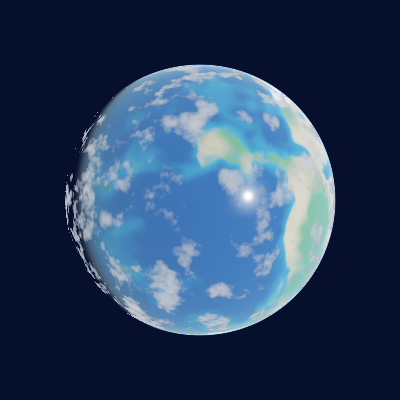 | **baked-map Earth**<br>drop-in NASA equirect texture + atmosphere<br>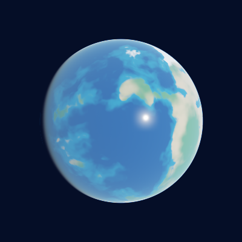 | **sky**<br>Rayleigh + Mie atmospheric scattering<br>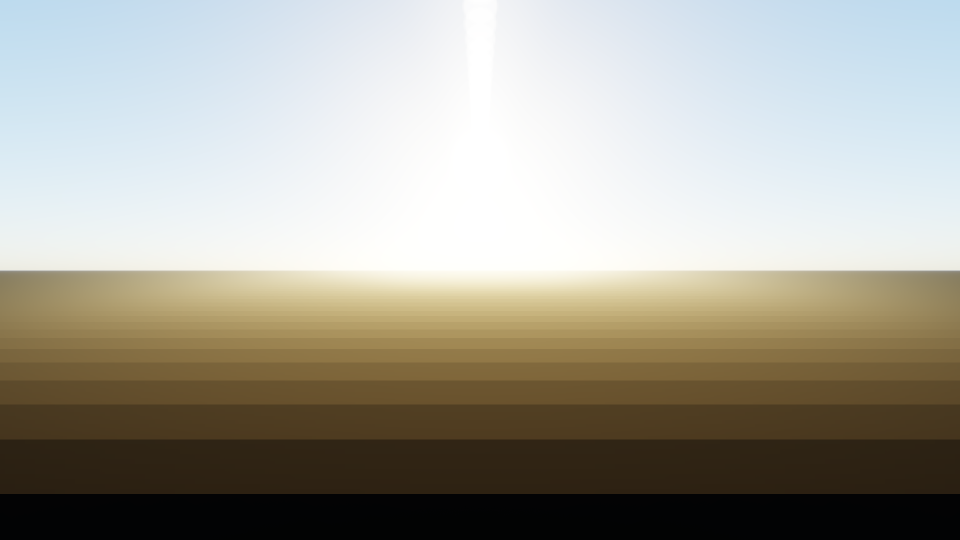 |
| **volumetric clouds**<br>HG phase, Beer–Lambert, sun light-march<br>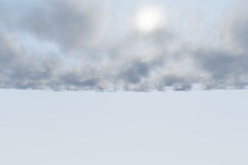 | **PBR demo**<br>GGX raymarch, soft shadows, AO, bloom<br>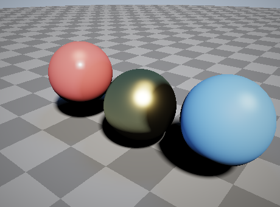 | **noise gallery**<br>fBm / Perlin / Worley / ridged / warp / curl<br>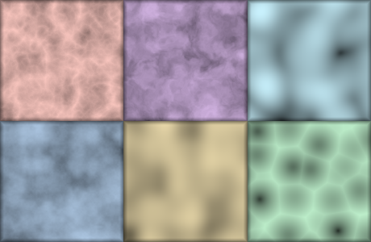 |
| **terrain**<br>raymarched heightfield + aerial perspective<br>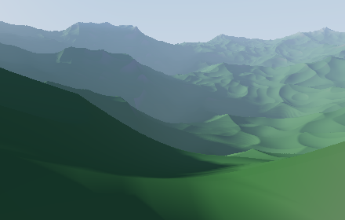 | **ocean**<br>analytic waves, Fresnel sky, GGX glitter, foam<br>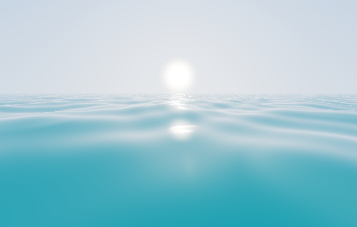 | **nebula**<br>embedded stars ionising filaments of gas + dust pillars<br>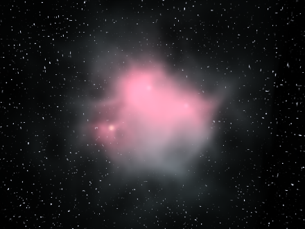 |
| **gas giant + rings**<br>banded atmosphere, red spot, ring shadows<br>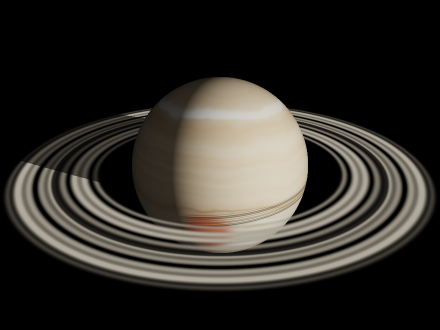 | **alien world**<br>twin coloured suns, violet sky, jagged terrain<br>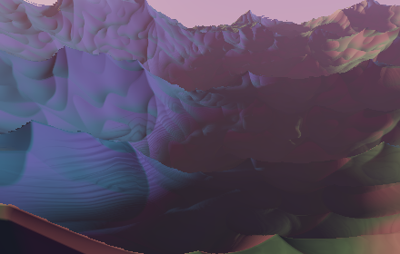 | **spiral galaxy**<br>log-spiral arms, core bulge, HII knots<br>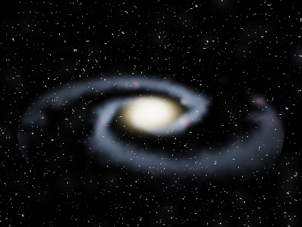 |
| **aurora**<br>volumetric light curtains over a night landscape<br>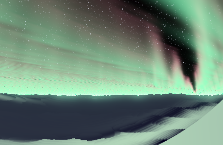 | **lava planet**<br>molten sea, cooled-crust rafts, basalt islands<br>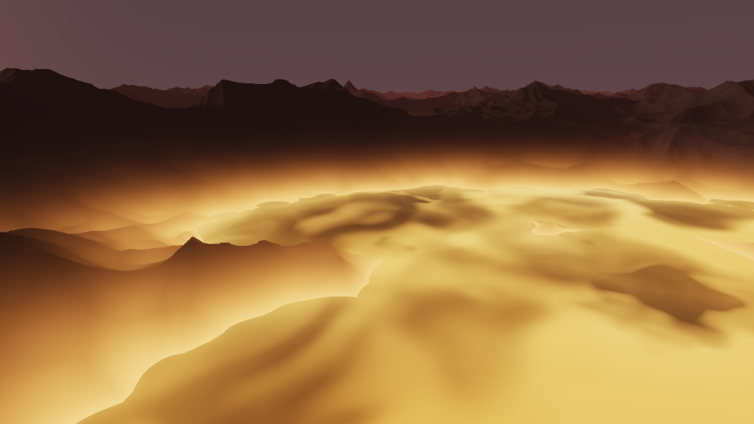 | **desert dunes**<br>wind ripples, long low-sun shadows, aerial haze<br>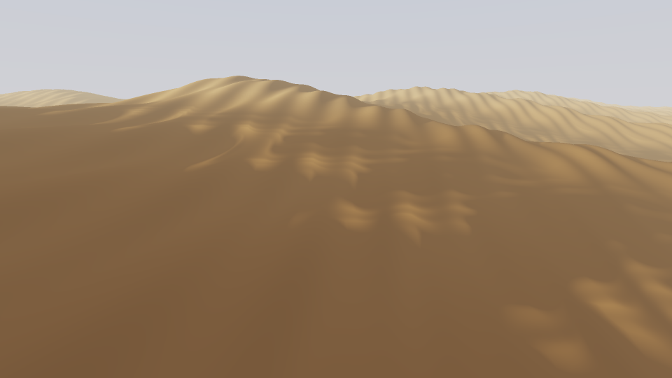 |
| **glacier**<br>blue ice + snow, subsurface glow, cold low sun<br>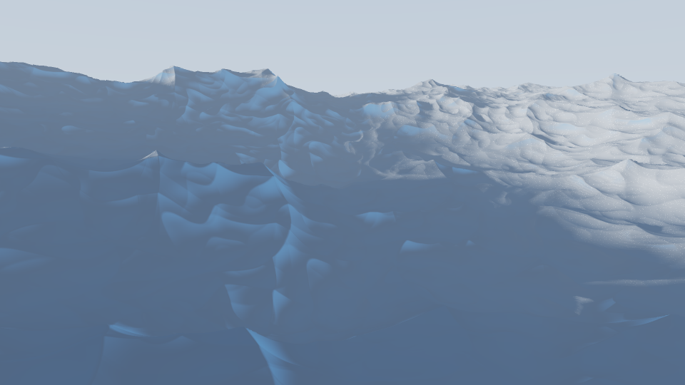 | **depth of field**<br>thin-lens focus pull, near/far bokeh<br>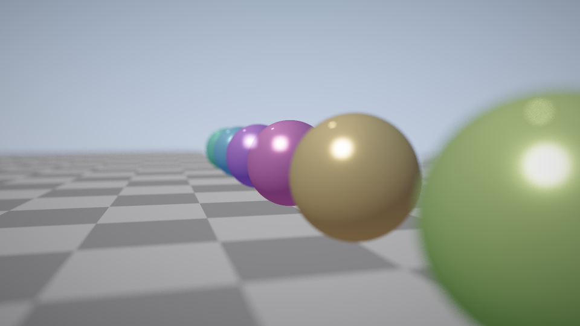 | **slot canyon**<br>layered sandstone + volumetric god-rays<br>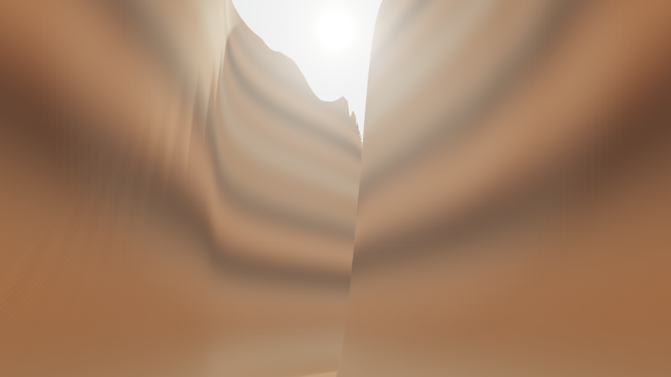 |
| **underwater reef**<br>rippling caustics, blue-green depth, god-rays<br>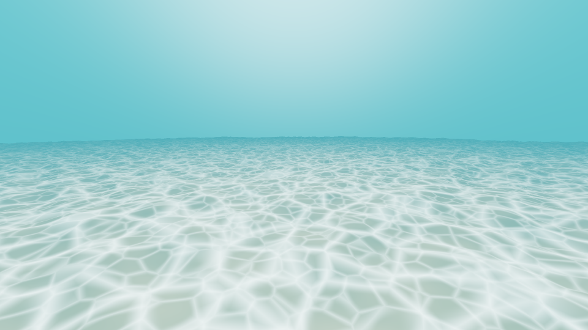 | **post-FX showcase**<br>blackbody orbs + starfield + full post chain<br>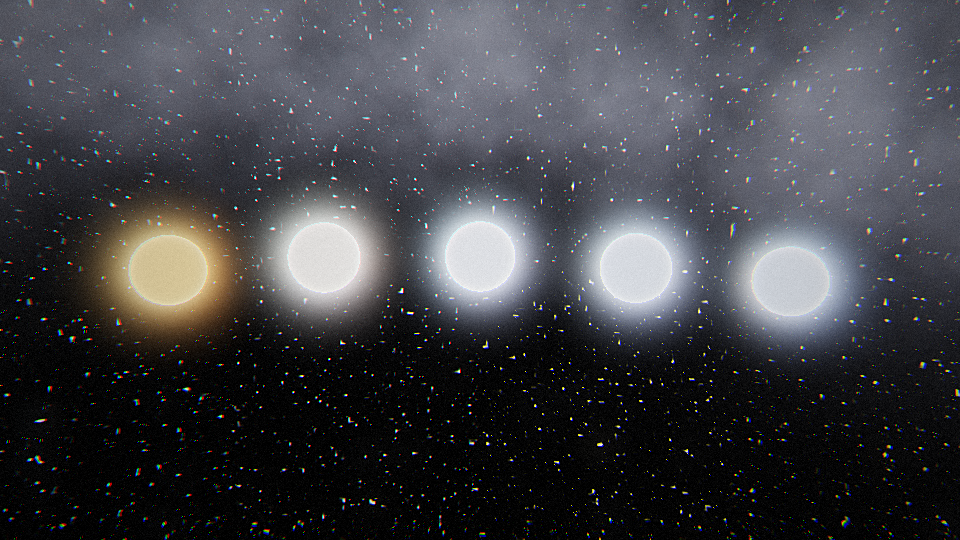 | **soft shadows + AO**<br>analytic sphere shadows + ambient occlusion, no SDF march<br>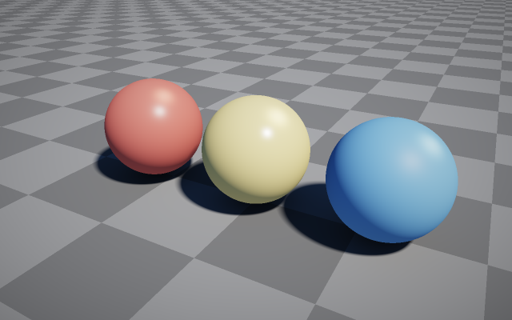 |
| **reflections**<br>Whitted mirror + glass + gold spheres, reflecting each other (bounce loop)<br>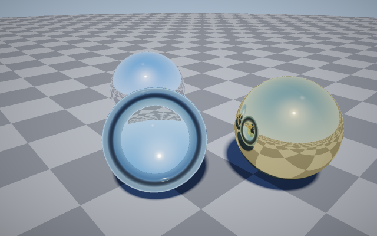 | | |

## Gravitational lensing — a black hole, ray-traced for real

`gargantua` — every camera ray is a **photon** integrated along a real **null geodesic** of the
Schwarzschild metric (`d²x/dλ² = −3/2·h²·x/r⁵`). Light falls past the horizon (the black shadow),
grazes the photon sphere (the bright ring), or bends *over the top* of the hole to strike the far
side of the accretion disk — the reason the disk arcs above and below the shadow. The disk carries
a Shakura–Sunyaev blackbody temperature gradient with relativistic Doppler beaming + gravitational
redshift; the background starfield is lensed by the bending. Deterministic (no Monte-Carlo), so it
orbits cleanly. See [Research 42](research/42-gravitational-lensing.md).

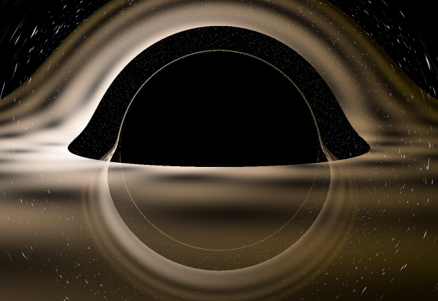

The camera orbiting the hole — the lensed disk and Einstein ring shifting as the geometry turns:

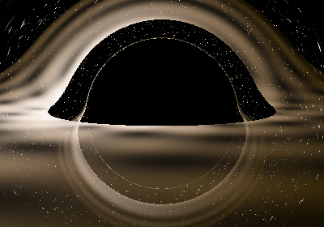

## Alien skies — ground-level vistas

Cinematic *surface* shots: the engine's heightfield / water renderer composed with
a procedural sky body, so the drama is where you'd actually stand and look up.

| | | |
|---|---|---|
| **ringed vista**<br>a huge ringed gas giant over a rust dune sea, rings crossing behind + in front of the disk<br>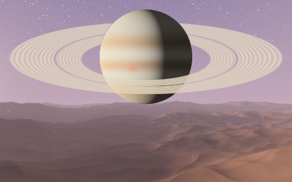 | **binary sea**<br>two suns setting over a wave-rippled Fresnel ocean, twin glitter paths<br>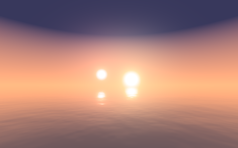 | **comet**<br>a great comet — blue ion + curved dust tail over a night ridge<br>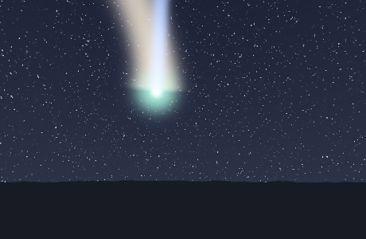 |
| **volcano**<br>a stratovolcano erupting at night — lava flows, summit fountain, ash plume<br>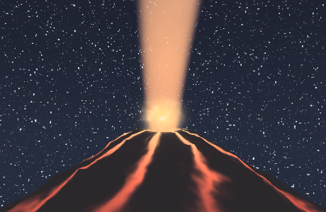 | **crystal cave**<br>translucent gem shards glowing amethyst, cyan and teal in the dark<br>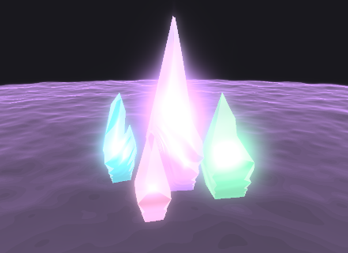 | |

## 3D fractals

Distance-estimated fractals (`warp_shaders.procedural.fractal`), sphere-traced
like any SDF and coloured from the **orbit trap**. Escape-time
([Research 13](research/13-3d-fractals.md)) and folding IFS
([Research 14](research/14-kifs-fractals.md)).

| | | |
|---|---|---|
| **Mandelbulb**<br>White–Nylander triplex power, glowing; power morphs 2→8<br>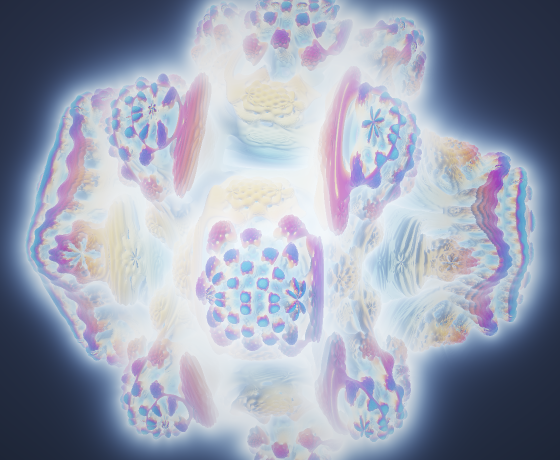 | **Mandelbox**<br>Lowe box-fold + sphere-fold (scale −1.5), the ringed cube<br>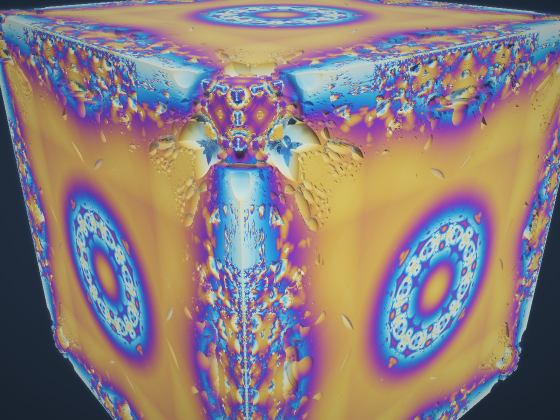 | **Menger sponge**<br>Quilez exact SDF, drilled-cube recursion 1→4<br>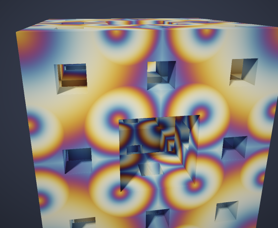 |
| **Sierpinski tetrahedron**<br>plane folds + scale, crystalline 3D gasket<br>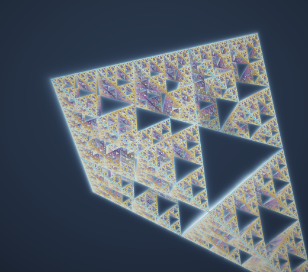 | **kaleidoscopic temple**<br>KIFS fold+rotate+scale — fractal architecture<br>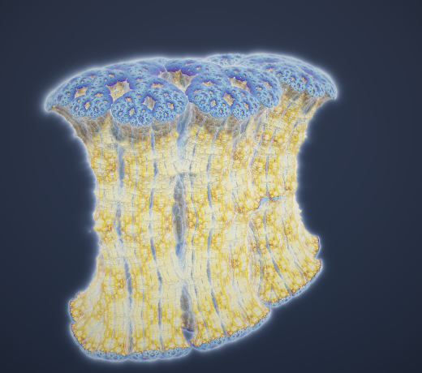 | |

## Nuclear detonations

A research-grade nuclear-fireball model (`warp_shaders.blast`) sized entirely
from declassified scaling laws (Glasstone & Dolan), calibrated to the measured
**Tsar Bomba**: the fireball, blast-damage rings, thermal radius, shock front and
mushroom rise all come from the yield. See
[Research 15](research/15-nuclear-fireball.md).

| | | |
|---|---|---|
| **Tsar Bomba** (50 Mt)<br>physically-sized fireball, shock ring flattening the forest, mushroom cloud<br>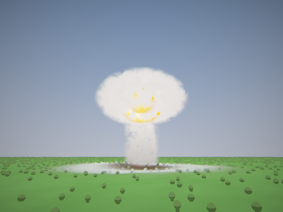 | **Super Tsar** (500 Mt)<br>10× yield — ~2.5× fireball, ~2.15× wider blast zone<br>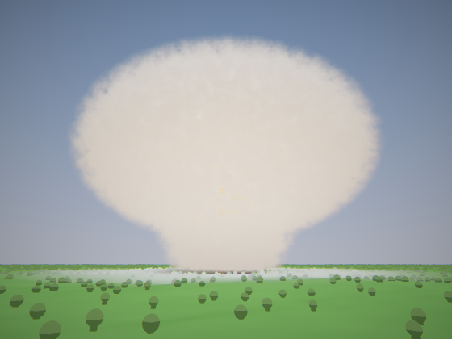 | **Super Tsar in space**<br>vacuum burst over a planet — no blast/mushroom, a ballistic plasma shell<br>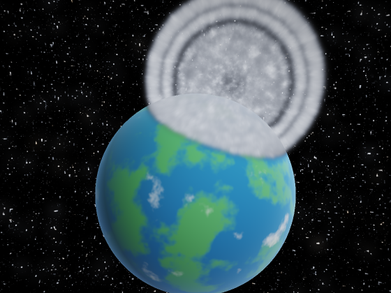 |

The full sequence — thermal **flash** → fireball → **shock front** flattening the
forest → **mushroom** climb (`--frames`):


**The nuke, tested on a city** (`nuke_city`) and **on a suburb** (`nuke_suburb`) —
the [buildings](#buildings) SDF kit meets the blast: a dusk built-up area whose
buildings **collapse into a burning field of rubble** as the overpressure front
sweeps out to the 5 psi ring. Everything inside is a scorched crater of glowing
embers with thin smoke wisps rising; the survivors (lit windows still on) ring the
far perimeter; the mushroom climbs from the centre. The city stands towers; the
suburb stands pitched-roof houses under a smaller yield — same collapse model,
human scale. See [Research 18](research/18-nuke-the-city.md).

| downtown of towers | neighbourhood of houses |
|---|---|
| 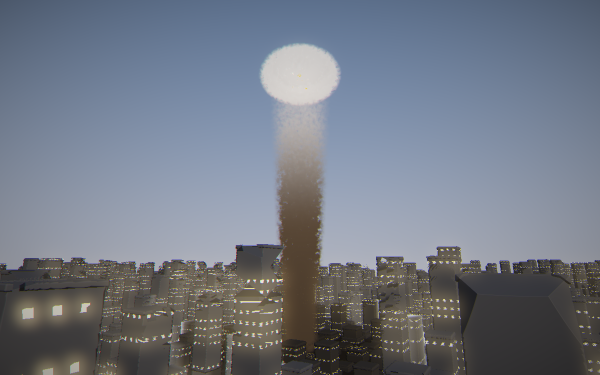 | 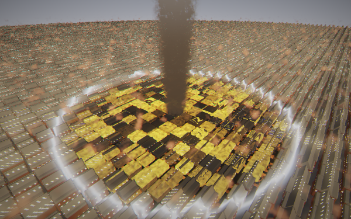 |

## Buildings

Architecture as signed distance fields (`warp_shaders.buildings`) — a parametric
kit (towers / houses / blocks) and a whole **city** or **suburb** from one
function via per-lot domain repetition + hashed variation. Built as clean solids
so they sphere-trace, and so they can later become **blast targets**. See
[Research 17](research/17-buildings.md).

| | |
|---|---|
| **city**<br>a night skyline of SDF towers — floor-band relief, glowing window grids, light-pollution haze<br>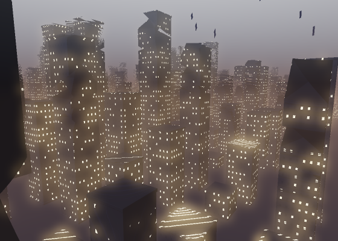 | **suburb**<br>a neighbourhood of pitched-roof houses — plaster walls, terracotta roofs, warm sun<br>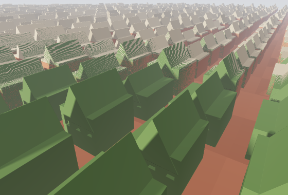 |

## A living world

The three strands meet: the L-System ecosystem grown on a planet's surface, lit
by the solar system's actual **sun(s)** (`life.render.render_world`). The plants
are phototropic, so the living meadow follows the light. See
[Research 16](research/16-a-living-world.md).

| | |
|---|---|
| **living world**<br>the meadow under one sun across a day — amber dawn/dusk, long shadows, plants following the light<br>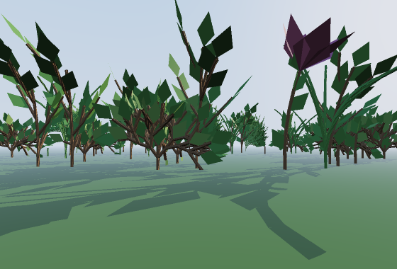 | **twin suns**<br>a Kepler-16 "Tatooine" binary — a warm K-dwarf + a cool companion, two coloured shadows, a double sunset<br>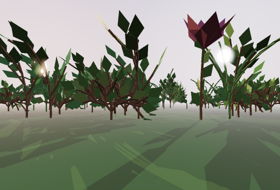 |

One sun crossing the sky over a day (dawn → noon → dusk), shadows sweeping:

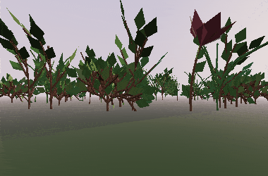

## Life — molecule to cell

The bottom of the "show life" ladder (`warp_shaders.life.molecular` /
`.cell`) — DNA and proteins as solid ray-traced meshes, the cell as a soft glow
volume. Each **animates**: the helix assembles, the chain folds, the cell
divides. See [Research 05](research/05-molecular-to-cell.md).

| | | |
|---|---|---|
| **DNA**<br>double helix, colour-coded base pairs (B-DNA)<br>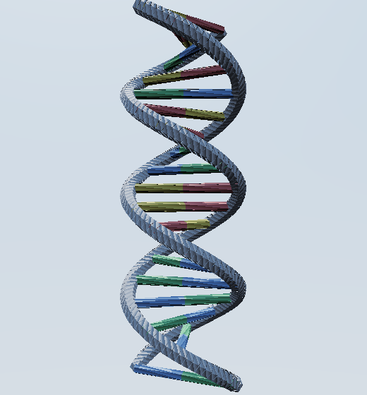 | **protein**<br>backbone folding extended→compact, N→C colour<br>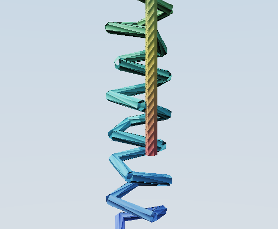 | **cell**<br>membrane + nucleus + organelles, dividing<br>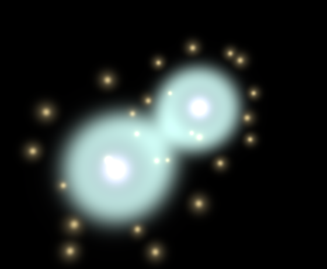 |

Assembling, folding, dividing:


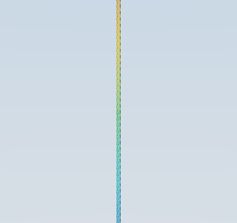
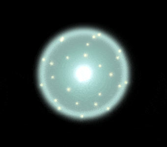

## Life — grown from L-Systems

Real plants grown from L-System grammars (`warp_shaders.life`), tessellated to
a mesh and **ray-cast** through the Warp engine. Generation advances with
`time`, so they grow. See [Research 04](research/04-lsystems.md).

| | | |
|---|---|---|
| **grass**<br>tuft of arching blades<br>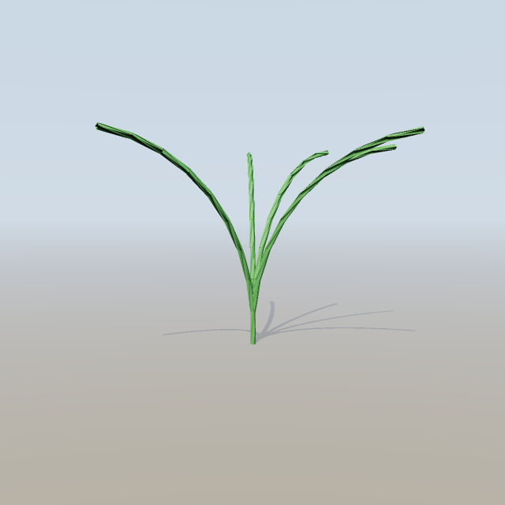 | **herb**<br>stochastic leafy plant, golden-angle leaves<br> | **tree**<br>parametric tapering tree + leafy canopy<br> |
| **fern**<br>bracketed frond unfurling into a fiddlehead (ABOP fig 1.24)<br> | **flower**<br>leafy stem that blooms into a whorl of petals at maturity<br> | **bush**<br>dense stochastic shrub, wide and leafy<br> |

Growth (`--frames 8 --fps 1`), sprout → tree, and the fern unfurling:


A whole **meadow** — grass, herb, flower, fern and bush merged into one mesh and
swaying in a single wind:


### Environmental response (the "obvious rules", ABOP §2.3.4)

Before any mind, the plant obeys physics — a **tropism** bends the turtle's
heading toward a direction each step, so the same grammar reacts to its world.

| | | |
|---|---|---|
| **phototropism**<br>sapling bends to follow a moving light<br> | **weeping**<br>shoots sag under gravity into a fountain<br> | **rain-fold**<br>leaves fold shut as rain sets in<br> |
| **wind**<br>tuft swaying as a gust pulses (time-varying tropism)<br> | | |

Following the light (`phototropism`), closing in the rain (`rain_fold`), and
swaying in a gust (`wind`):


### The mind — choosing to obey (Conway's Life)

Top of the ladder: a Conway Game-of-Life **mind** whose living population sets a
**drive** that *chooses* whether the plant seeks the light (open, phototropic) or
rests (sags, leaves folded) — a decision, not a reflex. The inset shows the grid
+ drive bar. See [Research 06](research/06-the-mind.md).


And a **per-branch** mind (`mind_branches`) — each shoot of one plant steered by a
different band of the grid, so some reach for the light and open while others sag
and fold shut, all at once ("close *piece of itself*"):


### Wave and collapse — futures resolving to one

The summit of the strand: several *possible* plant futures begin **superposed**
(a faint overlapping ghost cloud of what the plant might become) and **collapse**
to a single realised plant — the front sweeping tip→base (the future settling
first, reaching *backward* into its own history), with the Conway mind biasing
*which* future resolves. See [Research 07](research/07-wave-and-collapse.md).


### Ecosystem — a living meadow over the seasons

Life at the population scale: a patch of plants that live over **years** — born,
growing, blooming, senescing, dying, reseeding — **recolouring with the seasons**
and **competing for light** (a shaded plant grows less and leans toward the open
sky). See [Research 08](research/08-ecosystem.md).

| summer | autumn | winter |
|---|---|---|
|  |  |  |

A few years, seasons cycling and the meadow turning over:


## Super-Earth — one planet, every knob

One Warp kernel driven by a `PlanetConfig` struct: turn oceans, lakes, rivers,
mountains, snow, volcanoes, lava, vegetation, life, cities, atmosphere, clouds
and moons on or off independently — same code, a whole family of worlds. Then the
**super-planets** (no solid surface) and a configurable orbital bombardment. See
[Research 09](research/09-super-earth.md).

| | | |
|---|---|---|
| **earth-like**<br>oceans, green continents, rivers, snow, clouds<br> | **barren**<br>cratered dead rock, no air or water<br> | **ocean world**<br>mostly water with island arcs<br> |
| **volcanic**<br>young molten world, lava vents<br> | **riverlands**<br>continents laced with rivers + lakes<br> | **arid**<br>desert continents (vegetation off)<br> |
| **living** (night)<br>bioluminescence + city lights<br> | **flat** (mountains off)<br>the with/without-mountains knob<br> | **moons**<br>configurable system (rocky/icy/lava/desert)<br> |

### Super-planets — higher degrees of freedom

| | | |
|---|---|---|
| **gas giant**<br>banded zonal flow + great red spot<br> | **windstorm**<br>turbulent bands + cyclone eyes<br> | **electrostorm**<br>slate thunderheads + lightning<br> |

Lightning crackling across the electrostorm:


### Orbital bombardment (`se_nuked`)

Configurable strikes — warhead **count**, spatial **distribution** (uniform /
clustered / equatorial / spiral), **delay**, **interval**, and detonations **in
parallel** per wave. Fireballs cool through a blackbody ramp; each strike leaves
an expanding shock-ring scar.


## Cosmos & bodies

| | | |
|---|---|---|
| **earth** (from space)<br> | **planet** (lit + lens flare)<br> | **sun** (turbulent corona)<br> |
| **black hole** (lensed disk)<br> | | |

Also in this family: `neutron_star` (pulsar with relativistic jets) and
`starfield` (a minimal registry demo). The **sub-atomic** particles (proton,
atom, quarks, …) have their own section below.

## Sub-atomic — the Standard Model

The bottom of the "bottom-up" ladder (`warp_shaders.subatomic`) — every
fundamental particle rendered as a **physically-grounded volumetric field**:
colour-charged quark plasmas bound by QCD gluon flux tubes, real hydrogen
orbital densities |ψ_nlm|², charged leptons in their EM fields, the force
bosons, and the Higgs. See [Research 21](research/21-standard-model.md).

**Composites — the nucleus & the atom.** Three colour-charged quarks in a
confinement bag, and the electron's real probability cloud.

| | | | |
|---|---|---|---|
| **proton** (uud)<br> | **neutron** (udd)<br> | **atom** (hydrogen 1s)<br> | **orbitals** (2p / 3d …)<br> |

**Quarks** — six flavours, size ∝ log(mass), colour charge cycling.

| | |
|---|---|
| **up quark** (light, red)<br> | **top quark** (heaviest, magenta)<br> |

**Leptons** — charged leptons in their EM fields; neutrinos as faint shimmers.

| | | |
|---|---|---|
| **electron** (cyan field)<br> | **tau** (violet field)<br> | **neutrino** (faint, oscillating)<br> |

**Bosons + the Higgs** — the force carriers and the mass-giver.

| | | | |
|---|---|---|---|
| **photon** (EM wave)<br> | **gluon** (colour double-helix)<br> | **W** (weak, decaying)<br> | **Higgs** (field + γγ)<br> |

**Everything at once, and the weak force in action.**

| | |
|---|---|
| **the Standard Model chart** — all 17 particles, family-coloured, mass-scaled<br> | **beta decay** — n→p+e⁻+ν̄ₑ, a down quark flips emitting a W⁻<br> |

**Mesons** — a quark and an **antiquark** on one gluon flux string.

| | | | |
|---|---|---|---|
| **pion** (u d̄)<br> | **kaon** (u s̄)<br> | **J/ψ** (c c̄)<br> | **Υ upsilon** (b b̄)<br> |

**Baryons beyond the nucleon** — the hyperons + the Δ resonance (three quarks, flavour-tinted).

| | | | | |
|---|---|---|---|---|
| **Λ lambda** (u d s)<br> | **Σ sigma** (u u s)<br> | **Ξ xi** (u s s)<br> | **Ω omega** (s s s)<br> | **Δ delta** (u u u)<br> |

**Antimatter** — same mass, opposite charge.

| | | |
|---|---|---|
| **positron** (e⁺)<br> | **antiproton** (ū ū d̄)<br> | **annihilation** (e⁻e⁺→γγ)<br> |

**Charged & exotic atoms.**

| | |
|---|---|
| **ion** (a cation, mid-ionisation)<br> | **positronium** (e⁻+e⁺ atom)<br> |

**Hypothetical** — predicted by theory, never observed.

| | | | | |
|---|---|---|---|---|
| **tachyon** (Cherenkov cone)<br> | **graviton** (spacetime ripple)<br> | **magnetic monopole** (radial B)<br> | **axion** (Primakoff flashes)<br> | **dark matter** (lensing)<br> |

**In the detector** — how we actually see them.

| | |
|---|---|
| **bubble chamber** — charged tracks curling in a magnetic field, radiating from a vertex<br> | **particle collision** — a collider event display, a spray of tracks from the vertex<br> |

## Chemistry — atoms into molecules

The rung up from the atoms (`warp_shaders.molecules`) — ball-and-stick molecules,
crystals and reactions. See [Research 22](research/22-chemistry-and-molecules.md).

| | | | |
|---|---|---|---|
| **water** H₂O (bent)<br> | **CO₂** (linear)<br> | **methane** CH₄ (tetrahedral)<br> | **ammonia** NH₃<br> |
| **benzene** C₆H₆ (aromatic ring)<br> | **salt crystal** NaCl lattice<br> | **combustion** CH₄+2O₂→CO₂+2H₂O<br> | **periodic table** (block-coloured)<br> |

## The origin & the largest scales

The other bookend of the sub-atomic (`warp_shaders.scenes`, cosmology) — the Big
Bang, the CMB, and the cosmic web. See
[Research 23](research/23-origin-and-large-scale-universe.md).

| | | |
|---|---|---|
| **Big Bang** — expanding cooling plasma<br> | **CMB** — the anisotropy sky (Planck palette)<br> | **cosmic web** — filaments + voids<br> |
| **first stars** — cosmic dawn igniting<br> | **structure formation** — the web assembling<br> | |

## The living body

Cells, organs and the mind (`warp_shaders.scenes`, biology). See
[Research 24](research/24-the-living-body.md).

| | | |
|---|---|---|
| **the mind** — a neural network firing<br> | **neuron** — an action potential<br> | **heartbeat** — a beating heart<br> |
| **DNA transcription** — helix → mRNA<br> | **red blood cells** — biconcave discs flowing<br> | |

## Earth & weather

The planet as a machine (`warp_shaders.scenes`, Earth systems). See
[Research 25](research/25-earth-and-weather.md).

| | | |
|---|---|---|
| **hurricane** — a cyclone from orbit<br> | **lightning storm** — forked bolts<br> | **plate tectonics** — glowing plate boundaries<br> |
| **ocean currents** — the great conveyor<br> | **water cycle** — evaporation → rain<br> | |

## Extraordinary cosmos

Three of the most extraordinary objects and events in the universe, all built on
the same reusable GR photon integrator that bends light around the black hole. See
[Research 19](research/19-extraordinary-cosmos.md).

| | | |
|---|---|---|
| **wormhole**<br>an Ellis throat — this universe lensed into an Einstein ring, *another* universe seen through the portal<br> | **quasar**<br>a supermassive black hole firing twin relativistic synchrotron jets over a Doppler-beamed disk<br> | **tidal disruption**<br>a star spaghettified into a hot spiral debris stream spiralling into the hole, flaring as it feeds<br> |

The three feeding/lensing events also evolve — the quasar precesses and the star
spaghettifies over time:


## More cosmic events

More of the universe's most violent events, reusing the stellar-evolution
expanding-shell integrator and the same starfield. See
[Research 20](research/20-more-cosmos-worlds-crossstrand.md).

| | | |
|---|---|---|
| **supernova**<br>a core-collapse flash then an expanding, cooling shock shell (Chevalier self-similar blast)<br> | **kilonova**<br>a neutron-star merger — inspiral, merge flash, blue-polar + red-equatorial r-process ejecta and a short-GRB jet<br> | **gravitational waves**<br>a chirping binary inspiral whose m=2 quadrupole ripples warp the starfield until the pair merges<br> |

The two explosive events evolve frame-by-frame — flash, then expansion:


## More worlds

Exotic bodies and events built on the shared ray-sphere + procedural-noise
toolkit. See [Research 20](research/20-more-cosmos-worlds-crossstrand.md).

| | | |
|---|---|---|
| **ringed planet**<br>a crystalline ice world girdled by a bright icy ring (Cassini gap, mutual planet/ring shadowing) + a moon<br> | **ocean moon**<br>a global-ocean world — sun-glinted water, ice caps, thin clouds, atmosphere rim — under a banded gas-giant parent<br> | **transit**<br>an exoplanet crossing its star — a limb-darkened disk occulted by a dark planet with a backlit atmosphere ring<br> |

## Cross-strand

Where the strands meet — the buildings city and the living meadow, dropped onto
other worlds. See [Research 20](research/20-more-cosmos-worlds-crossstrand.md).

| | |
|---|---|
| **city on a planet**<br>the buildings-city SDF wrapped onto a large sphere — an ecumenopolis curving to a planetary horizon with atmosphere and space above<br> | **exomoon life**<br>the L-System meadow on an exomoon, under a looming ringed gas-giant parent filling the twilight sky<br> |

## Elements (stylized Bohr atoms)

Twenty elements (H through Ar) live in `scenes/elements.py`, each a `Scene` in
the shared `SCENES` list — `python render.py --scene carbon`, `--scene argon`, …

| | | | |
|---|---|---|---|
| hydrogen<br> | helium<br> | carbon<br> | oxygen<br> |
| neon<br> | sodium<br> | chlorine<br> | argon<br> |

## Physics simulations — particle blasts

Real Warp particle physics (gravity, buoyancy, drag) driving nuclear /
thermonuclear blasts and Earth-impact scenarios — see `warp_shaders/sim/`.

| | | |
|---|---|---|
| **nuclear** blast chain<br> | **thermonuclear** blast<br> | **earth impact** (grounded)<br> |

Animated: [`nuclear.gif`](sim/nuclear.gif), [`thermonuclear.gif`](sim/thermonuclear.gif).

## The solar system — the namesake, configurable end to end

One renderer (`warp_shaders.cosmos`) draws any mix of stars (sun / neutron star /
white dwarf / black hole) and configurable planets on chosen Keplerian orbits,
plus an optional nebula. `--frames` animates the orbits. See
[Research 10](research/10-solar-system.md).

The celestial bodies (each a reusable shader):

| | | | |
|---|---|---|---|
| **sun**<br>granulation + spots + corona<br> | **neutron star**<br>compact + twin pulsar beams<br> | **white dwarf**<br>hot blue-white remnant<br> | **black hole**<br>lensing + disk + photon ring<br> |

The systems:

| | | |
|---|---|---|
| **solar_system** (the first)<br>neutron star + a planet on an ellipse<br> | **binary**<br>two suns + a planet around the pair<br> | **trinary**<br>sun + neutron star + white dwarf + gas giant<br> |
| **black-hole system**<br>a hole lensing a companion sun + planet<br> | **nebula cradle**<br>a sun + two planets inside a nebula<br> | **positioned nebula**<br>filamentary volume, placed + sized<br> |

The first system orbiting, and a **collapsing** system — two suns spiral in,
merge, collapse to a black hole (supernova), which swallows the planet:


### Cinematics — camera paths + the reel

`ss_flyby` sweeps a **keyframed Catmull-Rom camera** around the trinary system
(orbit + elevation ease + push-in, looping). Author moves with
[`engine.camera_path`](api/engine.md#shots--enginecamera_path), render sequences
to **MP4 / WebP / GIF** (`render.py --video`, [`engine.video`](api/engine.md#video--enginevideo)),
and stitch scenes into a showcase with [`reel.py`](guides/cinematics.md).


```bash
python render.py --scene ss_flyby --frames 144 --fps 24 --video out/flyby.mp4
python reel.py -o out/showcase.mp4 --width 960 --height 540 --fps 24
```

## The stellar life-cycle — one star, birth to remnant

One star evolving on a normalized timeline (`cosmos.stellar_evolution`): a
protostar condenses in a dusty **cradle**, settles onto the **main sequence**,
swells into a **red giant**, and ends — for a Sun-like star as a **planetary
nebula + white dwarf**, for a massive star as a **supernova + neutron star or
black hole**. Each frame carries a live **H-R diagram** inset tracing the star's
path across temperature/luminosity. See [Research 11](research/11-stellar-evolution.md).


The **mass fork** — same code, three initial masses, three endings:

| | | |
|---|---|---|
| **stellar_lifecycle** (1 M☉)<br>→ planetary nebula → white dwarf | **stellar_massive** (14 M☉)<br>→ supernova → neutron star | **stellar_collapse** (30 M☉)<br>→ supernova → black hole |

```bash
python render.py --scene stellar_lifecycle --frames 120 --fps 6 --video out/life.mp4
python render.py --scene stellar_massive --time 14 -o supergiant.png
```

## Colliding galaxies — bridges and tails

The largest set-piece: two galaxies in a gravitational fly-by, modelled as a
**Toomre restricted N-body** encounter (`cosmos.galaxy_dynamics`) — two point-mass
cores under mutual gravity, each ringed by thousands of **massless test
particles**. A **prograde** disk throws out a long tidal **tail** and a **bridge**
toward the companion (the Antennae / Mice look); a **retrograde** disk barely
responds — the classic Toomre & Toomre 1972 contrast. Each galaxy's stars keep
their colour, so the tidal debris stays legible. See
[Research 12](research/12-galaxy-collisions.md).


```bash
python render.py --scene galaxy_collision  --frames 64 --fps 6 --video out/tails.mp4
python render.py --scene galaxy_retrograde --frames 64 --fps 6 --video out/retro.mp4
```

## Four more frontiers — the machine, mathematics, the deep ocean, the far future

A second four-strand round (see [Research 26](research/26-the-machine.md)–[29](research/29-megastructures-and-far-future.md)).

**The machine** — computation bottom-up: a **MOSFET** switching on and off, a
universal **NAND** gate cycling its truth table, a **CPU die** as an aerial city of
logic, a **memory** array streaming its bitstream, the **internet** as a packet mesh,
a **qubit** on the Bloch sphere, and **gradient descent** rolling down a loss landscape.

| transistor | logic_gates | cpu_die | data_flow | internet | quantum_computer | ai_training |
|---|---|---|---|---|---|---|
|  |  |  |  |  |  |  |

**Mathematics made visible** — the **Lorenz** attractor (deterministic chaos), a
**trefoil** torus knot, a **Klein bottle** (figure-8 immersion), a **tesseract**
rotating in 4D, a **Penrose** tiling (aperiodic five-fold order), and **domain
colouring** of a complex function.

| strange_attractor | torus_knot | klein_bottle | tesseract | penrose_tiling | domain_coloring |
|---|---|---|---|---|---|
|  |  |  |  |  |  |

**The deep ocean** — a bioluminescent **jellyfish**, a **black-smoker** vent with tube
worms, a drifting cloud of **living light**, a sunlit **coral reef**, the **Mariana
Trench** descent, and a **whale fall** feeding the abyss.

| jellyfish | hydrothermal_vent | bioluminescent | coral_reef | mariana_trench | whale_fall |
|---|---|---|---|---|---|
|  |  |  |  |  |  |

**Megastructures & the far future** — a **Dyson sphere** caging a star, a **ringworld**,
the interior of an **O'Neill cylinder**, a **space elevator**, a **generation ship**,
and a **Matrioshka brain** turning a star into computation.

| dyson_sphere | ringworld | oneill_cylinder | space_elevator | generation_ship | matrioshka_brain |
|---|---|---|---|---|---|
|  |  |  |  |  |  |

## Four more frontiers — light, matter, fields, the cell

A third four-strand round (see [Research 30](research/30-light-and-optics.md)–[33](research/33-the-cell-up-close.md)).

**Light & optics** — a **prism** dispersing white light, the **rainbow**'s 42°/51° bows,
soap-bubble **thin-film** iridescence, a **diffraction grating**'s spectral orders,
pool-floor **caustics**, and a Michelson **interferometer**'s fringes.

| prism | rainbow | thin_film | diffraction_grating | caustics | interferometer |
|---|---|---|---|---|---|
|  |  |  |  |  |  |

**States of matter & phase** — a **plasma** arc, a dendritic **crystallization** front,
a **ferrofluid**'s Rosensweig spikes, a rolling **boil**, a **Bose–Einstein** condensate
peak, and **glass vs crystal** order.

| plasma_arc | crystallization | ferrofluid | boiling | bose_einstein | glass_vs_crystal |
|---|---|---|---|---|---|
|  |  |  |  |  |  |

**Electromagnetism & fields** — a **bar magnet**'s dipole field, an **electric dipole**,
an **EM wave** (E⊥B), a **solenoid**, **magnetic reconnection** at an X-point, and
**cyclotron** motion.

| bar_magnet | electric_dipole | em_wave | solenoid | magnetic_reconnection | cyclotron |
|---|---|---|---|---|---|
|  |  |  |  |  |  |

**The cell up close** — a **virus** (capsid + spikes), a **mitochondrion**, a
**ribosome** translating, a **bacterium**, the **lipid bilayer**, and an **immune cell**
engulfing a pathogen.

| virus | mitochondrion | ribosome | bacterium | lipid_bilayer | immune_cell |
|---|---|---|---|---|---|
|  |  |  |  |  |  |

**Electronics — silicon to the memory bit** — a computer built from the ground up,
respecting the physics. A monocrystalline **silicon** boule, its diamond-cubic
**crystal** lattice, a **wafer** with thin-film sheen, and a doped **p-n junction**.

| silicon_ingot | silicon_crystal | silicon_wafer | pn_junction |
|---|---|---|---|
|  |  |  |  |

The **discrete components** every board carries — a colour-banded **resistor**, an
electrolytic + ceramic **capacitor**, a glowing **LED** + diode, a wound **inductor**,
and a quartz **crystal oscillator**.

| resistor | capacitor | led | inductor | crystal_oscillator |
|---|---|---|---|---|
|  |  |  |  |  |

**Interconnect & packaging** — a **PCB** with copper traces and vias, a **DIP** chip
package, a **BGA** ball-grid underside, and the gold **bond wires** from die to leadframe.

| pcb | ic_package | bga | bond_wire |
|---|---|---|---|
|  |  |  |  |

**The memory & logic cells (the bit)** — a **DRAM** cell (1T1C, the RAM bit), a **NAND
flash** floating-gate cell (the SSD bit), a **CMOS inverter** (the logic atom), and a 6T
**SRAM** cell (the cache bit).

| dram_cell | nand_flash_cell | cmos_inverter | sram_cell |
|---|---|---|---|
|  |  |  |  |

**Boards & memory blocks** — the actual boards a computer is made of, assembled from
the components. A **RAM** stick (DRAM chips on a DIMM), an **NVMe SSD** (flash on M.2),
a **CPU** under its heat spreader, and a finned **heatsink**.

| ram_stick | nvme_ssd | cpu | heatsink |
|---|---|---|---|
|  |  |  |  |

The **graphics card** and the platform — a bare **GPU package** (die + on-package
memory), the full **graphics card** (shroud, fans, PCIe, power), the **motherboard**
everything plugs into, and a look **inside the GPU die** at the shader-core grid.

| gpu_package | graphics_card | motherboard | gpu_floorplan |
|---|---|---|---|
|  |  |  |  |

**GPU cooling styles** — the same board, three coolers: a high-end **open-air**
triple-fan card, a **blower** (induction-fan) card that exhausts out the back, and a
**fanless / open** card with the guts (GPU, GDDR, VRM, traces) exposed.

| graphics_card (open-air) | gpu_blower (blower) | gpu_open (fanless) |
|---|---|---|
|  |  |  |

**The board itself** — `gpu_board`, a workstation-class GPU PCB with no cover at all
(in the spirit of an RTX 6000 Pro Blackwell): a huge exposed die, a full ring of GDDR7,
a dense multi-phase VRM, capacitor arrays, a 12VHPWR connector, and PCIe fingers.

| gpu_board |
|---|
|  |

`gpu_board` opened up in detail — the exposed die is a real **die-shot floorplan**
(SM/GPC compute clusters, an L2-cache spine, memory-controller PHYs), ringed by GDDR7,
a dense multi-phase VRM, capacitor and SMD fields, white **silkscreen**, and diff-pair
routing. And **`gpu_flagship`** dresses that same board in a premium metal cooler.

| gpu_board (bare, detailed) | gpu_flagship (premium cover) |
|---|---|
|  |  |

## GPU singularity — the mind overclocks an RTX board to destruction

The **real** `gpu_board` (the RTX 6000 Pro Blackwell-class card) run past its limits —
half carrier-transport physics, half AI-escape lore. The mind draws power **through the
actual board** (12VHPWR → VRM → die → the GDDR7 ring — cold blue electron current, white
photon flashes), the memory overheats and each block pops, an overflow **singularity**
forms over the die, and then the die goes off in a **proper mushroom cloud** — the engine's
own nuclear-fireball model. Then the mind escapes into the quantum void. All animate over
`--frames`; the frames below are single moments of the arc. See
[research 37](research/37-gpu-singularity.md).

| gpu_singularity (the mushroom off the board) | memory_overflow (block + rising mushroom) |
|---|---|
|  |  |

| power_draw (electrons through the real board) | mind_escape (aftermath) |
|---|---|
|  |  |

And the other way to blow it — **`gpu_memory_nuke`** keeps the die alive and sends the
overload into the **memory**: each of the thirteen GDDR packages around the GPU detonates
in its own mushroom cloud, one by one, a rolling chain sweeping across the memory ring while
the die glows white-hot at the centre feeding them.

| gpu_memory_nuke (the memory going off one by one) |
|---|
|  |

The chain rolling across the memory ring — each GDDR package going off in turn while the
die survives at the centre:


The whole arc — electrons drawn through the real board, the memory overheating and the
blocks popping, the overflow singularity, then the die going off in a mushroom cloud:


## Electricity in motion

Charge that flows and does work — the sequel to pushing electrons through the GPU. A
toolkit (`warp_shaders.electric`) glows conductors, arcs, and a **fractal lightning**
generator (recursive midpoint displacement + branching = stepped-leader dielectric
breakdown). Every scene animates over `--frames`. See
[research 38](research/38-electricity.md).

| lightning | tesla_coil | spark_gap |
|---|---|---|
|  |  |  |

| plasma_globe | capacitor_charge | electric_motor |
|---|---|---|
|  |  |  |

| transformer | power_grid |
|---|---|
|  |  |

A luminous exotic-particle study built on the same glow toolkit — **`tachyon_v2`**: a ray
climbing the axis with a central orb and two rays spiralling into a conic destination, the
motion carried by pulses of glow racing up the beam and the spirals (a companion to the
Cherenkov-cone `tachyon`).

| tachyon_v2 |
|---|
|  |

## Engine leap — global illumination

Light that **bounces**. A Monte-Carlo **path tracer** (Warp on-device RNG, cosine-weighted
hemisphere sampling over an SDF scene) lets rays scatter around the room many times — so
colour bleeds between surfaces, shadows go soft and contact-tight for free, and everything is
lit consistently by whatever emits. Then the same integrator absorbs **specular** materials
(mirror + Snell/Fresnel glass), **subsurface** scattering (a bounded random walk inside a
translucent solid), and **motion blur** (a random instant sampled per ray). See
[research 39](research/39-engine-leap.md).

| cornell_box (path-traced global illumination) | glass_box (reflection + refraction) |
|---|---|
|  |  |
| subsurface (translucent random walk) | motion_blur (distributed temporal sampling) |
|  |  |

And one GDDR block up close — filling layer by layer, then a small mushroom off its roof:


## Physics simulations

Not physics *drawn* — physics **run**. A state stepped forward in time by the governing
equations on Warp, the image is whatever the dynamics produce. See
[research 40](research/40-physics-sims.md).

| nbody (O(N²) gravity — two star clouds colliding) | fluid (2-D Navier–Stokes smoke plume) |
|---|---|
|  |  |

The fluid plume rising and rolling — buoyancy, vorticity confinement, pressure projection every step:


## Waves, resonance & interference

One equation — ``u_tt = c²∇²u`` — seen four ways: sand jumping to the still nodal lines of a
ringing plate (**cymatics**), two ripples crossing, a drum singing its **Bessel** modes, and a
plane wave squeezing through **two slits**. Analytic eigenmodes for the plate and drum;
a real finite-difference wave-equation sim (`sim/wave.py`) for the ripple tank and double slit.
See [research 41](research/41-waves-and-resonance.md).

| chladni (cymatics — sand on the nodal lines) | ripple_tank (two-source interference) |
|---|---|
|  |  |
| standing_membrane (a drumhead's Bessel mode) | double_slit (Young's fringes forming) |
|  |  |

The plate sweeping up through its resonances, and the double slit's fringe fan building as the wave arrives:

|  |  |
|---|---|
